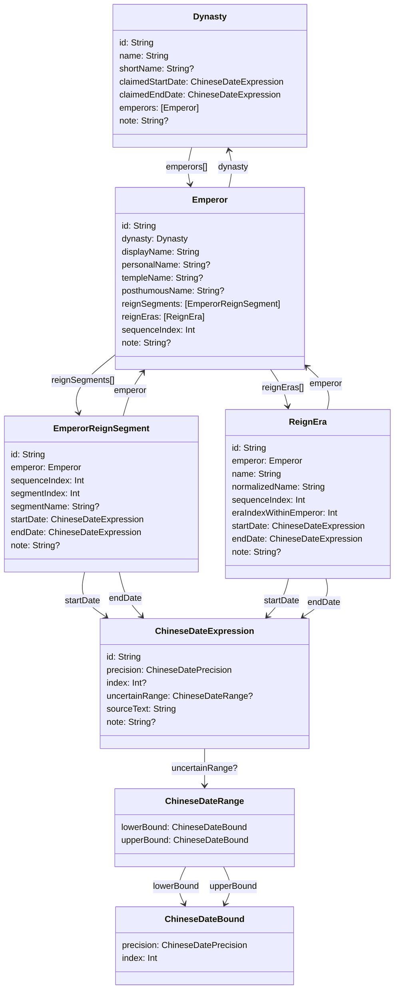

# 年号、皇帝与朝代数据模型

## 目的

本文档定义年号、皇帝和朝代之间的基础数据模型。范围包括：

- 皇帝属于哪个朝代
- 皇帝可能拥有的一次或多次在位区间
- 年号属于哪个皇帝
- 年号在朝代时间线和皇帝名下的排序
- 年号、在位区间如何通过农历日期表达连接到基础日历数据

本文档复用 `Docs/data model/data-model-dynasty.md` 中已有的 `Dynasty` 和 `ChineseDateExpression`。年号和皇帝是 political attribution，不应混入 `ChineseLunarYear`、`ChineseLunarMonth`、`ChineseLunarDay` 等基础 calendar facts。

## 核心原则

### 朝代、皇帝、年号是三层关系

每个皇帝一定属于，并且仅属于某一个朝代。每个年号一定属于，并且仅属于某一个皇帝。

也就是说，基础 ownership 是：

```text
Dynasty -> Emperor -> ReignEra
```

一个朝代可以有多个皇帝，一个皇帝可以有多个年号。朝代和年号之间不建立直接 ownership；如果需要查询某个朝代下的所有年号，可以通过 `ReignEra.emperor.dynasty` 这条关系路径查询。

### 年号顺序不能从皇帝顺序推导

年号有自己的历史顺序。这个顺序不一定等同于皇帝列表顺序。

例如同一位皇帝可能多次登基，朝代时间线可能出现：

```text
皇帝 A -> 皇帝 B -> 皇帝 A
```

如果只按皇帝列表排序，第二次属于皇帝 A 的年号会被放错位置。因此 `ReignEra.sequenceIndex` 必须独立保存，作为该朝代年号顺序的来源。

### 皇帝身份和在位区间分开

`Emperor` 表示“某位皇帝这个历史人物在某个朝代中的身份”，不是一次登基事件。

一次实际在位区间由 `EmperorReignSegment` 表达。同一位皇帝多次登基时，只建立一条 `Emperor`，但建立多条 `EmperorReignSegment`。

这样可以同时支持：

- 一个皇帝只有一次连续在位
- 一个皇帝多次登基
- 一个皇帝有多个年号
- 一个皇帝的年号分布在不同在位区间附近

### 时间使用农历表达

年号开始、年号结束、在位开始、在位结束都应优先保存为项目已有 Chinese calendar 中的农历时间表达。

这些时间使用 `ChineseDateExpression`，继承同一套精度规则：

- `year`：只知道农历某一年。
- `month`：知道农历某年某月，但不知道具体日。
- `day`：知道农历某年某月某日。
- `range`：只能确定上下界，不能确定为单个年、月、日。
- `unknown`：有原文，但暂时不能结构化。

不能为了建立年号关系，把不精确时间强行补成正月初一或某月初一。

### 年号不是日期身份

农历年月日不依赖年号。年号只是某个政治时间线上的标签，不应替代 `dayIndex`、`lunarMonthIndex` 或 `lunarYearNumber`。

当某天需要显示年号时，应先用基础日历模型确定目标 `dayIndex`，再查询覆盖该日的 `ReignEra` 区间。

### 在位区间和年号区间不必重合

新帝即位后，日期可能继续沿用先帝年号，直到正式改元。尤其明清以后，继位发生在农历年中或年底时，改元常放到下一年；这类“即位边界”和“改元边界”不在同一天的情况并不罕见。

例如清代康熙六十一年十一月雍正帝即位，但“雍正元年”从下一年开始。在即位到岁末之间，政治上的在位皇帝已经是雍正帝，日期标签仍然是“康熙六十一年”。

因此模型中必须保留两条相关但不完全重合的时间线：

```text
EmperorReignSegment = 谁在位
ReignEra = 当天使用哪个年号
```

`EmperorReignSegment` 不应 ownership 包含 `ReignEra`。某个在位区间下显示哪些年号，应通过 `emperor` 关系和日期区间重叠关系查询，而不是从父子包含关系推导。

## 实体概览



示例约定：`Type(id: "...")` 表示关系已经指向这个已有对象，不表示运行时必须通过 `id` 查询；被当前对象持有的值对象直接展开字段。示例中的 `index` 使用占位符，实际整数由基础日历数据导入后填写。

## 引用与持有说明

### `Dynasty` 和 `Emperor`

一个 `Dynasty` 可以有多个 `Emperor`。一个 `Emperor` 必须属于一个 `Dynasty`。

SwiftData 落地时，`Emperor.dynasty` 是权威关系。`Emperor.id` 仍然可以作为从 JSONL、CSV 或人工资料导入时使用的稳定来源标识，但不需要再额外保存 `dynastyID` 这种外键字段来表达 SwiftData 关系。

一般情况下，`Dynasty` 和 `Emperor` 应保留双向导航：`Dynasty.emperors` 方便从朝代进入皇帝列表，`Emperor.dynasty` 表达皇帝所属朝代。SwiftData 中这仍然是一组关系，不是两套外键；实现时只在一侧写 `@Relationship(..., inverse:)`，另一侧让 SwiftData 通过 inverse 维护。

如果未来因为超大静态 seed store 或导入性能选择不保存反向数组，也仍可用 `Emperor` 作为 fetch root，筛选 `emperor.dynasty == targetDynasty`，再按 `sequenceIndex` 排序。但这是性能取舍，不是首选领域模型。

`Dynasty` 不应因为删除某个 `Emperor` 而被级联删除。`Dynasty` 是更上层的独立实体。

### `Emperor` 和 `EmperorReignSegment`

一个 `Emperor` 可以有一个或多个 `EmperorReignSegment`。

`EmperorReignSegment` 表示实际在位区间，而不是新的皇帝身份。多次登基时，同一个 `Emperor.id` 可以出现在多个 `EmperorReignSegment` 中。

`EmperorReignSegment.sequenceIndex` 表示该朝代政治时间线中的在位区间顺序。`EmperorReignSegment.segmentIndex` 表示同一皇帝自己的第几次在位。

例如某位皇帝第一次在位、被废、后来复辟：

```text
Emperor(id: "tang_zhongzong")

EmperorReignSegment(id: "tang_zhongzong_first_reign", segmentIndex: 0)
EmperorReignSegment(id: "tang_zhongzong_restoration", segmentIndex: 1)
```

这两条在位区间都指向同一个 `Emperor`。

### `Emperor` 和 `ReignEra`

一个 `Emperor` 可以有零个、一个或多个 `ReignEra`。

零个表示该皇帝所在时代或当前数据范围内没有结构化年号记录，或者首版暂未录入年号。不要为了满足关系而制造空年号。

每个 `ReignEra` 必须指向一个 `Emperor`。年号不直接归属于朝代；朝代通过 `ReignEra.emperor.dynasty` 得到。

首版不需要在 `ReignEra` 上保存 `dynastyID` 或 `emperorID`。如果后续发现某些大批量查询需要更快的筛选，可以增加只用于性能的 denormalized 字段，但它们不应成为关系真相来源。

这里的“属于皇帝”表达的是年号自身的归属，不表示该年号覆盖的每一天都由这位皇帝在位。继任皇帝正式改元前沿用前任年号时，某一天的 `EmperorReignSegment` 可能指向新帝，而覆盖该日的 `ReignEra` 仍然指向前任皇帝。

### `ReignEra` 和 `ChineseDateExpression`

一个 `ReignEra` 单向持有两个不同语义的日期表达：`startDate` 和 `endDate`。

这不是多个同类日期列表，因为这里表达的是年号使用区间的两个边界。即使某个边界暂时解析不出来，也保留一个 `precision = unknown` 的 `ChineseDateExpression`，用来承载原文和说明。

`startDate` 和 `endDate` 是 `ReignEra` 独占的 ownership 字段。SwiftData 中可以使用 `@Relationship(deleteRule: .cascade)`。删除一条年号记录时，它独占的日期表达可以随之删除；删除日期表达不应反向删除皇帝或朝代。

### `EmperorReignSegment` 和 `ChineseDateExpression`

一个 `EmperorReignSegment` 也单向持有 `startDate` 和 `endDate`。

在位区间和年号区间是两类不同事实，不要为了节省对象而复用同一个 `ChineseDateExpression`。例如某位皇帝登基日和某个年号启用日可能相同，但它们的历史语义不同，`sourceText` 和 `note` 也可能不同。

### 排序字段之间的关系

`Emperor.sequenceIndex`、`EmperorReignSegment.sequenceIndex` 和 `ReignEra.sequenceIndex` 表达不同排序：

- `Emperor.sequenceIndex`：皇帝列表中的默认展示顺序。
- `EmperorReignSegment.sequenceIndex`：朝代政治时间线中的在位区间顺序。
- `ReignEra.sequenceIndex`：朝代政治时间线中的年号顺序。

三者不能互相替代。尤其不能用 `Emperor.sequenceIndex` 推导 `ReignEra.sequenceIndex`，因为同一位皇帝可能多次登基。

## SwiftData 落地建议

建议新增三个 `@Model`：

- `Emperor`
- `EmperorReignSegment`
- `ReignEra`

推荐稳定键和索引：

- `Emperor`：`#Unique<Emperor>([\.id])`；可按 `sequenceIndex` 排序。
- `EmperorReignSegment`：`#Unique<EmperorReignSegment>([\.id])`；可按 `sequenceIndex` 和 `segmentIndex` 排序。
- `ReignEra`：`#Unique<ReignEra>([\.id])`；可按 `sequenceIndex`、`eraIndexWithinEmperor` 和 `normalizedName` 查询或排序。

关系字段建议：

- `Dynasty.emperors` 是朝代到皇帝列表的反向导航关系。
- `Emperor.dynasty` 是皇帝所属朝代的权威关系。
- `Emperor.reignSegments` 是皇帝到在位区间列表的反向导航关系。
- `EmperorReignSegment.emperor` 是在位区间所属皇帝的权威关系。
- `Emperor.reignEras` 是皇帝到年号列表的反向导航关系。
- `ReignEra.emperor` 是年号所属皇帝的权威关系。
- `startDate` 和 `endDate` 是 ownership 字段，可以使用 cascade delete rule。

如果关系在导入过程中需要分阶段解析，可以先在导入器内部保留 source id lookup table，等所有对象建好后再填 SwiftData relationship；不要为了导入方便把外键字段永久提升为领域模型字段。

如果以后改成完整双向导航，只在一侧写 `@Relationship(..., inverse:)`，不要在关系两端重复写 relationship 宏。SwiftData 模型不要使用 `description` 作为属性名；说明文字统一使用 `note`。

## `Emperor`

表示一位皇帝这个历史人物在某个朝代中的身份。

建议字段：

- `id`：稳定标识，例如 `western_han_wudi`、`tang_zhongzong`。
- `dynasty`：SwiftData 关系，指向所属 `Dynasty`。
- `displayName`：主要显示名，例如“汉武帝”“唐中宗”。
- `personalName`：本名，可选，例如“刘彻”。
- `templeName`：庙号，可选，例如“世祖”。
- `posthumousName`：谥号，可选。
- `reignSegments`：该皇帝的一次或多次在位区间。
- `reignEras`：该皇帝名下的年号。
- `sequenceIndex`：皇帝在该朝代人物列表中的默认排序。
- `note`：争议、别名或取名说明。

示例：

```text
Emperor {
    id: "western_han_wudi"
    dynasty: Dynasty(id: "western_han")
    displayName: "汉武帝"
    personalName: "刘彻"
    templeName: null
    posthumousName: "孝武皇帝"
    sequenceIndex: 6
    note: null
}
```

```text
Emperor {
    id: "tang_zhongzong"
    dynasty: Dynasty(id: "tang")
    displayName: "唐中宗"
    personalName: "李显"
    templeName: "中宗"
    posthumousName: null
    sequenceIndex: 3
    note: "同一皇帝有两段在位区间"
}
```

约束：

- `id` 全局唯一。
- `dynasty` 必须指向一条真实存在的 `Dynasty`。
- 同一个 `dynasty` 下，`sequenceIndex` 建议唯一，用于稳定展示。
- `sequenceIndex` 不等于在位区间顺序，也不等于年号顺序。

## `EmperorReignSegment`

表示一次实际在位区间。

建议字段：

- `id`：稳定标识。
- `emperor`：SwiftData 关系，指向所属 `Emperor`。
- `sequenceIndex`：该朝代政治时间线中的在位区间顺序。
- `segmentIndex`：同一皇帝自己的第几次在位，从 `0` 开始。
- `segmentName`：可选，例如“初立”“复辟”。
- `startDate`：在位开始日期表达。
- `endDate`：在位结束日期表达。
- `note`：边界争议说明。

示例：

```text
EmperorReignSegment {
    id: "tang_zhongzong_first_reign"
    emperor: Emperor(id: "tang_zhongzong")
    sequenceIndex: 3
    segmentIndex: 0
    segmentName: "初立"
    startDate: ChineseDateExpression {
        id: "tang_zhongzong_first_reign_start"
        precision: day
        index: <嗣圣元年登基日对应的 dayIndex>
        uncertainRange: null
        sourceText: "嗣圣元年即位"
        note: null
    }
    endDate: ChineseDateExpression {
        id: "tang_zhongzong_first_reign_end"
        precision: day
        index: <被废次日或归属切换日对应的 dayIndex>
        uncertainRange: null
        sourceText: "嗣圣元年被废"
        note: "半开区间上界"
    }
    note: "第一次在位"
}
```

```text
EmperorReignSegment {
    id: "tang_zhongzong_restoration"
    emperor: Emperor(id: "tang_zhongzong")
    sequenceIndex: 5
    segmentIndex: 1
    segmentName: "复辟"
    startDate: ChineseDateExpression {
        id: "tang_zhongzong_restoration_start"
        precision: day
        index: <神龙元年复位日对应的 dayIndex>
        uncertainRange: null
        sourceText: "神龙元年复位"
        note: null
    }
    endDate: ChineseDateExpression {
        id: "tang_zhongzong_restoration_end"
        precision: day
        index: <景龙四年结束边界对应的 dayIndex>
        uncertainRange: null
        sourceText: "景龙四年崩"
        note: "半开区间上界"
    }
    note: "第二次在位"
}
```

约束：

- `id` 全局唯一。
- `emperor` 必须指向一条真实存在的 `Emperor`。
- 同一个 `emperor` 下，`segmentIndex` 建议连续且唯一。
- 同一个 `emperor.dynasty` 下，`sequenceIndex` 表示在位区间历史顺序。
- `startDate` 和 `endDate` 换算成 dayIndex 查询边界后，必须满足 `start < end`。

## `ReignEra`

表示一个年号。

建议字段：

- `id`：稳定标识，例如 `western_han_wudi_jianyuan`。
- `emperor`：SwiftData 关系，指向所属 `Emperor`。
- `name`：原始显示名，例如“建元”。
- `normalizedName`：归一化检索名，例如去异体字、空格或来源差异后的形式。
- `sequenceIndex`：年号在该朝代政治时间线中的顺序。
- `eraIndexWithinEmperor`：该皇帝自己的第几个年号，从 `0` 开始。
- `startDate`：年号开始日期表达。
- `endDate`：年号结束日期表达。
- `note`：改元边界、争议或史料说明。

示例：

```text
ReignEra {
    id: "western_han_wudi_jianyuan"
    emperor: Emperor(id: "western_han_wudi")
    name: "建元"
    normalizedName: "建元"
    sequenceIndex: 0
    eraIndexWithinEmperor: 0
    startDate: ChineseDateExpression {
        id: "western_han_wudi_jianyuan_start"
        precision: year
        index: <建元元年对应的 lunarYearNumber>
        uncertainRange: null
        sourceText: "建元元年"
        note: "年精度"
    }
    endDate: ChineseDateExpression {
        id: "western_han_wudi_jianyuan_end"
        precision: year
        index: <元光元年对应的 lunarYearNumber>
        uncertainRange: null
        sourceText: "元光元年改元"
        note: "半开区间上界"
    }
    note: null
}
```

```text
ReignEra {
    id: "tang_zhongzong_shenlong"
    emperor: Emperor(id: "tang_zhongzong")
    name: "神龙"
    normalizedName: "神龙"
    sequenceIndex: 5
    eraIndexWithinEmperor: 1
    startDate: ChineseDateExpression {
        id: "tang_zhongzong_shenlong_start"
        precision: year
        index: <神龙元年对应的 lunarYearNumber>
        uncertainRange: null
        sourceText: "神龙元年"
        note: "年号顺序按朝代时间线排列"
    }
    endDate: ChineseDateExpression {
        id: "tang_zhongzong_shenlong_end"
        precision: year
        index: <景龙元年对应的 lunarYearNumber>
        uncertainRange: null
        sourceText: "景龙元年改元"
        note: "半开区间上界"
    }
    note: "属于唐中宗第二段在位附近的年号"
}
```

约束：

- `id` 全局唯一。
- `emperor` 必须指向一条真实存在的 `Emperor`。
- `name` 不做全局唯一约束；不同朝代或不同皇帝可能复用相同年号文字。
- 同一个 `emperor.dynasty` 下，`sequenceIndex` 表达朝代年号历史顺序。
- 同一个 `emperor` 下，`eraIndexWithinEmperor` 表达该皇帝自己的年号顺序。
- `startDate` 和 `endDate` 换算成 dayIndex 查询边界后，必须满足 `start < end`。

## 区间语义

历史时期建议使用半开区间：

```text
[start, end)
```

也就是说，开始边界包含，结束边界不包含。这样相邻年号和相邻在位区间可以共享一个边界而不重叠。

`ReignEra` 自己保存 `startDate` 和 `endDate`，`EmperorReignSegment` 也自己保存 `startDate` 和 `endDate`。这两类区间不强制共享边界，因为“登基”“改元”“退位”“崩逝”“下一个年号启用”可能不是同一天，也可能只有不同精度的史料表达。

不要把 `ReignEra` 放入 `EmperorReignSegment` 作为子对象。新帝继位后沿用先帝年号时，年号区间会和前任皇帝的年号归属一致，却和新帝的在位区间发生重叠；父子包含关系无法正确表达这种交叉。

如果上界原文写的是“至某年”“至某月”“至某日”，导入时应按半开区间保存为下一个年、下一个月或次日的边界；原文仍保存在 `sourceText`。

## 年号纪年派生

日级展示不建议预先存每一天的年号纪年。优先从 `ReignEra` 区间派生：

1. 将目标日转成 `dayIndex`。
2. 找到满足 `start <= dayIndex < end` 的 `ReignEra`。
3. 将 `ReignEra.startDate` 换算到它所在的 `lunarYearNumber`。
4. 用目标日所在 `lunarYearNumber` 减去年号开始所在 `lunarYearNumber`，再加 `1`。

年号纪年默认从元年开始，所以不需要单独保存 `firstYearNumber`。例如某年中途改元，该年从改元日起到岁末仍显示“元年”，下一农历年显示“二年”。如果某个年号有特殊纪年规则，应在 `note` 中记录，并在后续 formatter 中单独处理；不要为了通常恒为 `1` 的值增加基础字段。

如果 `startDate` 只有范围精度或 `unknown`，无法可靠派生纪年数字时，UI 应展示原始 `sourceText` 或标记为 approximate，而不是给出看似精确的“某某三年”。

## 查询原则

### 查某个年号属于谁

1. 用 `ReignEra.id` 或 `normalizedName` 找到候选年号。
2. 读取 `ReignEra.emperor` 得到 `Emperor`。
3. 读取 `Emperor.dynasty` 得到 `Dynasty`。

如果同名年号有多个候选，必须展示多个结果或继续用朝代、时间范围消歧，不能按名称默认取第一条。

### 查某个朝代的皇帝

1. 读取 `targetDynasty.emperors`。
2. 按 `sequenceIndex` 排序。

如果某个存储版本为了性能没有保存 `Dynasty.emperors` 反向数组，则以 `Emperor` 作为查询对象，使用 `emperor.dynasty == targetDynasty` 筛选目标朝代，再按 `sequenceIndex` 排序。

### 查某个朝代的年号顺序

1. 使用 `ReignEra.emperor.dynasty` 筛选目标朝代下的年号。
2. 按 `sequenceIndex` 排序。
3. 展示时读取 `ReignEra.emperor.displayName`。

这样即使出现“皇帝 A -> 皇帝 B -> 皇帝 A”的多次登基场景，年号顺序仍然正确。

### 查某个皇帝的年号

1. 使用 `emperor` 关系筛选 `ReignEra`。
2. 按 `eraIndexWithinEmperor` 排序。
3. 如果需要放回完整朝代时间线，再使用 `sequenceIndex`。

`eraIndexWithinEmperor` 只表达该皇帝名下的年号顺序，不保证这些年号在朝代时间线上连续。

### 查某天对应哪些年号记录

1. 将目标日期转成 `dayIndex`。
2. 选择查询范围，例如某个 `Dynasty`、某个正统传统下的朝代，或全部政治实体。
3. 读取候选 `ReignEra.startDate` 和 `endDate`。
4. 按 `ChineseDateExpression` 的精度换算成 dayIndex 半开区间。
5. 找到满足 `start <= dayIndex < end` 的记录。

如果同一天命中多个并立政权或多个政治时间线，查询层应返回多个候选。UI 可以选择一个 primary record，同时提示“另有 N 条并立政权记录”。

注意：这一步得到的是“当天使用哪个年号”，不是“当天谁在位”。如果需要当天在位皇帝，应另查 `EmperorReignSegment`。两者可能在继位到改元之间短暂不一致。

### 查某个皇帝的在位区间

1. 使用 `emperor` 关系筛选 `EmperorReignSegment`。
2. 按 `segmentIndex` 排序，可得到该皇帝自己的多次在位列表。
3. 按 `sequenceIndex` 排序，可把这些区间放回朝代政治时间线。

如果只需要皇帝列表，不要从在位区间反推 `Emperor`；应直接查询 `Emperor` 并按 `sequenceIndex` 排序。

## 校验规则

导入或测试时至少应校验：

- 每个 `Emperor.dynasty` 都必须指向一条真实存在的 `Dynasty`。
- 每个 `EmperorReignSegment.emperor` 都必须指向一条真实存在的 `Emperor`。
- 每个 `ReignEra.emperor` 都必须指向一条真实存在的 `Emperor`。
- 同一个 `Emperor` 至少应有一条 `EmperorReignSegment`，除非 source data 明确标记为暂缺。
- 同一个 `emperor` 下，`EmperorReignSegment.segmentIndex` 不应重复。
- 同一个 `emperor` 下，`ReignEra.eraIndexWithinEmperor` 不应重复。
- 同一个 `emperor.dynasty` 下，`ReignEra.sequenceIndex` 不应重复。
- `ReignEra.name` 不要求全局唯一。
- `ReignEra.normalizedName` 不要求全局唯一。
- 所有 `startDate` 和 `endDate` 应满足 `ChineseDateExpression` 的字段组合约束。
- 所有可解析区间换算成 dayIndex 后，必须满足 `start < end`。

## 首版取舍

首版建议只做以下内容：

- 建立 `Emperor`。
- 建立 `EmperorReignSegment`，支持同一皇帝多段在位。
- 建立 `ReignEra`，支持年号到皇帝的归属。
- 年号和在位边界都使用 `ChineseDateExpression`。
- 保留所有原始中文时间到 `sourceText`。
- 使用 SwiftData relationship 和排序字段支持查询。

首版暂不做：

- 谥号、庙号、尊号、姓名之间的完整 alias 体系。
- 自动从任意中文史料文本解析出年号边界。
- 为每一天预生成年号 attribution row。
- 不同正统历史观下的 primary 年号选择。
- 一个年号跨多个互不承认的政治实体共用同一条结构化记录。

## 与现有模型的关系

`Docs/data model/data-model-dynasty.md` 定义的是朝代自身边界和正统时间线。本文档在其基础上补充皇帝和年号：

- `Dynasty` 继续表示朝代、政权或可被用户作为朝代浏览的政治实体。
- `Emperor` 挂在 `Dynasty` 下，表达某朝代中的皇帝身份。
- `EmperorReignSegment` 挂在 `Emperor` 下，表达一次实际在位。
- `ReignEra` 挂在 `Emperor` 下，表达年号。

`Docs/data model/data-model-calendar.md` 定义的是基础 calendar facts。本文档中的年号和皇帝不应混入基础农历年月日。

当日期可解析时，通过 `dayIndex` 与基础日历数据连接。这样同一天可以同时拥有：

- 公历表达
- 农历表达
- 干支信息
- 朝代自称时间范围
- 某种正统历史观下的朝代归属
- 一个或多个年号、皇帝归属记录
