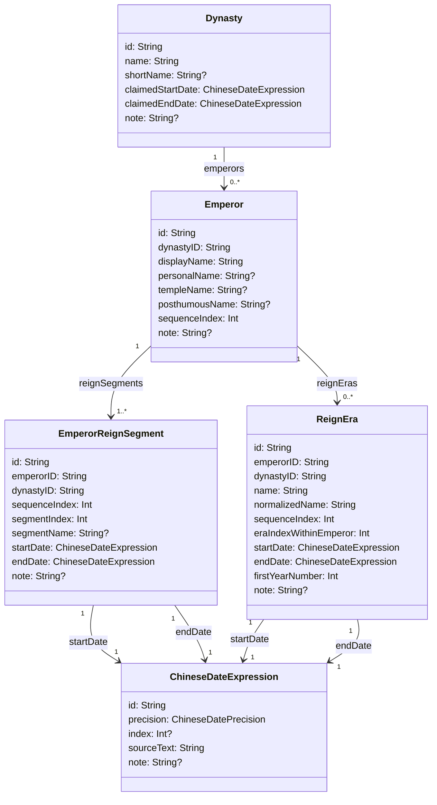

# 年号、皇帝与朝代 SwiftData 类图

## 目的

本文档定义年号、皇帝和朝代之间的结构化对应关系，并把关系直接表达成 SwiftData 适合落地的类图。

基础规则：

- 每个 `Emperor` 必须属于且仅属于一个 `Dynasty`。
- 每个 `ReignEra` 必须属于且仅属于一个 `Emperor`。
- 一个 `Dynasty` 可以有多个 `Emperor`。
- 一个 `Emperor` 可以有多个 `ReignEra`。
- `ReignEra` 本身按历史使用顺序排列，不能从 `Emperor` 的顺序自动推导。
- 同一位皇帝可能多次登基，所以皇帝实体和登基区间必须分开建模。

本文档复用现有 `Dynasty` 和 `ChineseDateExpression` 模型，不把年号纪年混入基础农历年月日模型。

## 核心类图



## SwiftData 关系落地

推荐把强约束写成必填稳定键，并在需要导航或预取时再建立 SwiftData relationship：

```swift
@Model
public final class Emperor {
    #Unique<Emperor>([\.id])
    #Index<Emperor>([\.dynastyID, \.sequenceIndex])

    public var id: String
    public var dynastyID: String
    public var displayName: String
    public var personalName: String?
    public var templeName: String?
    public var posthumousName: String?
    public var sequenceIndex: Int
    public var note: String?

    public var dynasty: Dynasty?
}
```

```swift
@Model
public final class ReignEra {
    #Unique<ReignEra>([\.id])
    #Index<ReignEra>([\.dynastyID, \.sequenceIndex], [\.emperorID, \.eraIndexWithinEmperor], [\.normalizedName])

    public var id: String
    public var emperorID: String
    public var dynastyID: String
    public var name: String
    public var normalizedName: String
    public var sequenceIndex: Int
    public var eraIndexWithinEmperor: Int
    public var firstYearNumber: Int
    public var note: String?

    public var emperor: Emperor?

    @Relationship(deleteRule: .cascade)
    public var startDate: ChineseDateExpression

    @Relationship(deleteRule: .cascade)
    public var endDate: ChineseDateExpression
}
```

如果以后改成完整双向导航，只在一侧写 `@Relationship(..., inverse:)`，不要在关系两端重复写 relationship 宏。被年号或登基区间独占的 `ChineseDateExpression` 使用 `.cascade`；`Dynasty`、`Emperor` 这类可独立查询的实体不应被子实体级联删除。

## 实体说明

### `Emperor`

表示一位皇帝这个历史人物在某个朝代中的身份。`Emperor` 不是一次登基事件，所以即使同一位皇帝两次登基，也只建立一条 `Emperor`。

字段说明：

- `id`：稳定标识，例如 `tang_zhongzong`。
- `dynastyID`：必填，指向唯一 `Dynasty`。
- `displayName`：主要显示名，例如“唐中宗”。
- `personalName`、`templeName`、`posthumousName`：可选辅助名称。
- `sequenceIndex`：皇帝在该朝代人物列表中的默认排序，不用于推导年号顺序。
- `note`：争议或取名说明。

约束：

- `id` 全局唯一。
- `dynastyID` 必须能找到一条 `Dynasty`。
- 同一个 `Dynasty` 下 `sequenceIndex` 用于展示排序，但不要求它等同于登基顺序或年号顺序。

### `EmperorReignSegment`

表示一次实际在位区间。它解决“同一皇帝多次登基”的问题。

字段说明：

- `id`：稳定标识，例如 `tang_zhongzong_first_reign`、`tang_zhongzong_restoration`。
- `emperorID`：所属皇帝。
- `dynastyID`：冗余保存所属朝代，用于索引和校验；必须与 `Emperor.dynastyID` 一致。
- `sequenceIndex`：该朝代政治时间线中的在位区间顺序。
- `segmentIndex`：同一皇帝自己的第几次在位，从 `0` 开始。
- `segmentName`：可选，例如“初立”“复辟”。
- `startDate`、`endDate`：在位半开区间 `[startDate, endDate)` 的边界。
- `note`：边界争议说明。

约束：

- 每个 `Emperor` 至少应有一个 `EmperorReignSegment`。
- 同一个 `Emperor` 下 `segmentIndex` 应连续。
- 同一个朝代时间线下 `sequenceIndex` 表示真实在位区间顺序，可以出现同一个 `emperorID` 多次。

### `ReignEra`

表示一个年号。年号直接归属于皇帝，不直接归属于朝代；朝代可从 `ReignEra.emperor.dynasty` 推导。

字段说明：

- `id`：稳定标识，例如 `han_wudi_jianyuan`。
- `emperorID`：必填，指向唯一 `Emperor`。
- `dynastyID`：冗余保存所属朝代，用于索引和校验；必须与 `Emperor.dynastyID` 一致。
- `name`：原始显示名，例如“建元”。
- `normalizedName`：归一化检索名，例如去异体字或空格后的形式。
- `sequenceIndex`：年号在该朝代政治时间线中的顺序。
- `eraIndexWithinEmperor`：该皇帝自己的第几个年号。
- `startDate`、`endDate`：年号使用半开区间 `[startDate, endDate)` 的边界。
- `firstYearNumber`：年号开始时的纪年数字，通常为 `1`，用于显示“元年”等文本。
- `note`：改元边界、争议或史料说明。

约束：

- 每个 `ReignEra` 只能指向一个 `Emperor`。
- `name` 不做全局唯一约束；不同朝代或不同皇帝可能复用相同年号文字。
- 同一个 `dynastyID` 下 `sequenceIndex` 应表达年号历史顺序。
- 同一个 `emperorID` 下 `eraIndexWithinEmperor` 应表达该皇帝自己的年号顺序。
- `ReignEra.sequenceIndex` 是年号顺序的唯一来源，不能通过 `Emperor.sequenceIndex` 或 `EmperorReignSegment.sequenceIndex` 推导。

## 多次登基示例

同一位皇帝两次登基时，不复制 `Emperor`：

```text
Emperor {
    id: "tang_zhongzong"
    dynastyID: "tang"
    displayName: "唐中宗"
    sequenceIndex: 3
}

EmperorReignSegment {
    id: "tang_zhongzong_first_reign"
    emperorID: "tang_zhongzong"
    dynastyID: "tang"
    sequenceIndex: 3
    segmentIndex: 0
    segmentName: "初立"
}

EmperorReignSegment {
    id: "tang_zhongzong_restoration"
    emperorID: "tang_zhongzong"
    dynastyID: "tang"
    sequenceIndex: 5
    segmentIndex: 1
    segmentName: "复辟"
}
```

年号仍然直接归属于 `tang_zhongzong`，但年号的 `sequenceIndex` 按实际年号顺序排，不受 `Emperor.sequenceIndex = 3` 限制。

## 查询原则

### 查某个年号属于谁

1. 用 `ReignEra.id` 或 `normalizedName` 找到候选年号。
2. 读取 `ReignEra.emperorID` 找到 `Emperor`。
3. 读取 `Emperor.dynastyID` 找到 `Dynasty`。

如果同名年号有多个候选，必须展示多个结果或继续用朝代、时间范围消歧，不能按名称默认取第一条。

### 查某个朝代的年号顺序

1. 使用 `dynastyID` 筛选 `ReignEra`。
2. 按 `sequenceIndex` 排序。
3. 展示时再通过 `emperorID` 关联皇帝名。

这样即使出现“皇帝 A -> 皇帝 B -> 皇帝 A”这样的多次登基场景，年号顺序仍然正确。

### 查某个皇帝的年号

1. 使用 `emperorID` 筛选 `ReignEra`。
2. 按 `eraIndexWithinEmperor` 排序。
3. 如果需要放回完整朝代时间线，再使用 `sequenceIndex`。

## 与日历基础模型的关系

`ReignEra.startDate`、`ReignEra.endDate`、`EmperorReignSegment.startDate` 和 `EmperorReignSegment.endDate` 都使用 `ChineseDateExpression`。当日期可解析时：

- `precision = year` 时，`index` 指向 `ChineseLunarYear.lunarYearNumber`。
- `precision = month` 时，`index` 指向 `ChineseLunarMonth.lunarMonthIndex`。
- `precision = day` 时，`index` 指向 `CalendarDay.dayIndex`。

日级 UI 可以通过目标 `dayIndex` 判断它落在哪个 `ReignEra` 半开区间内，再显示：

```text
Dynasty.name · Emperor.displayName · ReignEra.name + 纪年
```

首版不需要为每一天额外存一条年号记录；如果后续查询性能需要，可以再派生只读的日级索引表，但它应由 `ReignEra` 区间生成，不作为关系源头。

## 首版取舍

首版建议新增：

- `Emperor`
- `EmperorReignSegment`
- `ReignEra`

复用现有：

- `Dynasty`
- `ChineseDateExpression`
- `ChineseDateRange`
- `ChineseDateBound`

暂不处理：

- 谥号、庙号、尊号之间的复杂别名体系。
- 一个年号跨多个互不承认的政治实体共用同一条记录。
- 自动从任意中文史料文本解析出年号边界。
- 不同正统历史观下的年号主次选择；这应作为日级展示策略或后续 attribution 模型处理。
