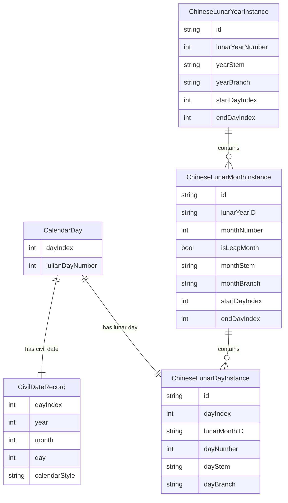

# 日历年月日数据模型

## 目的

本文档只定义 calendar facts 的数据模型：

- 农历日和公历日如何对应
- 农历年、月、日如何形成层级结构
- 年、月、日各自如何保存干支等日历信息

年号、帝王、王朝、政权归属等 political attribution 暂不在本文档中建模。后续如果需要接入这些信息，应通过同一套 day identity 关联，而不是混入基础日历模型。

## 核心原则

### 同一天先有一个稳定锚点

农历日和公历日不是两条 timeline 中互相猜测出来的值，而是同一个 absolute day 的两种表达。

因此数据层应先定义一个稳定的 day anchor：

- `dayIndex`：应用内部使用的连续日序号
- `julianDayNumber`：可选但推荐保存，用于和外部历算资料交叉校验

所有公历、农历、干支信息都挂在这个 day anchor 上。

### 公历日是同一天的 civil 表达

公历日期用于用户导航和显示，但不作为日历事实的唯一身份。

一条 day anchor 在当前数据集中应对应一条 civil date record：

- `year`
- `month`
- `day`
- `calendarStyle`

`calendarStyle` 用于说明这条 civil date 是 Julian 还是 Gregorian。首个版本可以使用固定的历法切换规则生成它，后续如需支持不同地区的 reform rule，再扩展生成策略。

### 农历年月日是树状层级

农历结构应按真实从属关系建模：

- `ChineseLunarYearInstance`
- `ChineseLunarMonthInstance`
- `ChineseLunarDayInstance`

日是最低层级。每个农历日属于一个农历月，每个农历月属于一个农历年。

干支不是独立漂浮的记录，而是年、月、日各自的属性：

- 年有年干支
- 月有月干支
- 日有日干支

## 关系图



## 实体设计

## CalendarDay

表示数据集中的一个 absolute day。

建议字段：

- `dayIndex: Int`
- `julianDayNumber: Int`

职责：

- 作为公历日和农历日对应关系的锚点
- 支持前一天、后一天、区间浏览等 timeline 操作
- 为后续年号、节气、节日等信息提供统一关联点

约束：

- `dayIndex` 在数据集中必须连续且唯一。
- `julianDayNumber` 在数据集中必须唯一。
- 一条 `CalendarDay` 应只有一条 `CivilDateRecord` 和一条 `ChineseLunarDayInstance`。

## CivilDateRecord

表示某个 absolute day 的 civil date 表达。

建议字段：

- `dayIndex: Int`
- `year: Int`
- `month: Int`
- `day: Int`
- `calendarStyle: CivilCalendarStyle`

建议 enum：

- `julian`
- `gregorian`

职责：

- 支持按公历日期跳转
- 支持 UI 中展示公历年月日
- 明确记录该公历标签采用的 civil calendar rule

说明：

- `CivilDateRecord` 不应持有农历年月日字段。
- 查找某个公历日期时，应先找到对应 `CalendarDay`，再读取其农历日节点。

## ChineseLunarDayInstance

表示一个具体农历日，也是农历层级中的最低节点。

建议字段：

- `id: String`
- `dayIndex: Int`
- `lunarMonthID: String`
- `dayNumber: Int`
- `dayStem: String`
- `dayBranch: String`

可选派生属性：

- `dayStemBranchDisplayName`
- `dayDisplayName`

职责：

- 表达“某个农历月里的第几日”
- 保存日干支
- 通过 `dayIndex` 和 `CalendarDay` 建立与公历日的一对一对应

约束：

- `dayNumber` 只能是 `1...30`。
- 同一个 `lunarMonthID` 下的 `dayNumber` 必须唯一。
- 每个 `ChineseLunarDayInstance` 必须对应且只对应一个 `CalendarDay`。
- 日干支应拆成 `dayStem` 和 `dayBranch` 保存，显示时再拼接。

## ChineseLunarMonthInstance

表示一个具体农历月。这里的“具体”指它已经属于某个农历年，而不是抽象的正月、二月。

建议字段：

- `id: String`
- `lunarYearID: String`
- `monthNumber: Int`
- `isLeapMonth: Bool`
- `monthStem: String`
- `monthBranch: String`
- `startDayIndex: Int`
- `endDayIndex: Int`

可选派生属性：

- `monthStemBranchDisplayName`
- `monthDisplayName`
- `dayCount`

职责：

- 作为农历日的 parent
- 表达闰月信息
- 保存月干支
- 保存该月覆盖的 absolute day range

约束：

- `monthNumber` 只能是 `1...12`。
- 同一个 `lunarYearID` 下，普通月的 `monthNumber` 必须唯一。
- 如果存在闰月，则同一年中同一个 `monthNumber` 可以同时有普通月和闰月，但二者必须通过 `isLeapMonth` 区分。
- `startDayIndex...endDayIndex` 必须覆盖该月所有日节点，且不应和同一年相邻月份产生重叠。

## ChineseLunarYearInstance

表示一个具体农历年。

建议字段：

- `id: String`
- `lunarYearNumber: Int`
- `yearStem: String`
- `yearBranch: String`
- `startDayIndex: Int`
- `endDayIndex: Int`

可选派生属性：

- `yearStemBranchDisplayName`
- `monthCount`
- `dayCount`

职责：

- 作为农历月的 parent
- 保存年干支
- 保存该年覆盖的 absolute day range

说明：

- `lunarYearNumber` 只是连续编号或导入后的年份标识，不等同于年号纪年。
- 年界首个版本按正月初一处理；如果未来要支持立春换年等干支年界规则，应作为明确的 calendar rule 扩展，而不是隐含在字段里。

## 推荐 ID 规则

ID 应稳定、可从导入结果重复生成，避免依赖 SwiftData 临时 persistent identifier。

建议格式：

- 年：`lunar-year-{lunarYearNumber}`
- 月：`lunar-year-{lunarYearNumber}-month-{monthNumber}`
- 闰月：`lunar-year-{lunarYearNumber}-leap-month-{monthNumber}`
- 日：`day-{dayIndex}` 或 `lunar-year-{lunarYearNumber}-month-{monthNumber}-day-{dayNumber}`

如果采用后一种日 ID，闰月必须出现在 ID 中，避免普通月和闰月的同日重名。

## 查询方式

### 通过公历日查农历日

步骤：

1. 使用 `CivilDateRecord(year, month, day, calendarStyle)` 找到 `dayIndex`。
2. 使用 `dayIndex` 找到 `CalendarDay`。
3. 读取对应的 `ChineseLunarDayInstance`。
4. 沿 `lunarMonthID` 读取所属月，再沿 `lunarYearID` 读取所属年。

返回结果可以组合出：

- 公历年月日
- 农历年、月、日
- 年干支、月干支、日干支
- 闰月标记

### 通过农历日查公历日

步骤：

1. 使用 `lunarYearID` 找到农历年。
2. 在该年下按 `monthNumber` 和 `isLeapMonth` 找到农历月。
3. 在该月下按 `dayNumber` 找到农历日。
4. 使用该日的 `dayIndex` 找到 `CalendarDay` 和 `CivilDateRecord`。

## Processed Artifact 建议

导入流水线可以先产出扁平 artifact，再导入 SwiftData 时组装层级。

建议文件：

- `Data/Processed/calendar_days/calendar_days.jsonl`

每行表示一个 absolute day，字段示例：

```json
{
  "dayIndex": 0,
  "julianDayNumber": 1721426,
  "civil": {
    "year": 1,
    "month": 1,
    "day": 1,
    "calendarStyle": "julian"
  },
  "lunar": {
    "yearNumber": 1,
    "yearStem": "辛",
    "yearBranch": "酉",
    "monthNumber": 11,
    "isLeapMonth": false,
    "monthStem": "庚",
    "monthBranch": "子",
    "dayNumber": 1,
    "dayStem": "甲",
    "dayBranch": "子"
  }
}
```

导入时由这份扁平数据生成：

- 一组 `CalendarDay`
- 一组 `CivilDateRecord`
- 去重后的 `ChineseLunarYearInstance`
- 去重后的 `ChineseLunarMonthInstance`
- 一组 `ChineseLunarDayInstance`

## 校验规则

导入或测试时至少应校验：

- `dayIndex` 连续无断裂。
- 每个 `CalendarDay` 恰好有一条 civil date 和一条 lunar day。
- 每个 `ChineseLunarDayInstance` 都能向上找到 month 和 year。
- 每个 month 的 day count 只能是 29 或 30。
- 每个 year 的 month count 通常是 12 或 13。
- 同一年中闰月不能超过一个，除非 source data 明确支持特殊情况并记录原因。
- 年、月、日干支字段都必须是合法天干和地支。
- 月和年的 `startDayIndex...endDayIndex` 必须与子节点范围一致。

## 与现有代码的映射

当前 persistence model 已经接近这个结构：

- `ChineseCalendarDay` 同时承担 absolute day anchor 和 lunar day node 的职责。
- `CivilDateRecord` 保存 civil date 表达。
- `ChineseLunarMonthInstance` 保存农历月节点和月干支。
- `ChineseLunarYearInstance` 保存农历年节点和年干支。

后续可以选择两条路线之一：

- 保持现状：继续让 `ChineseCalendarDay` 同时保存 `dayIndex`、`julianDayNumber`、`lunarDayRawValue` 和日干支。
- 拆分模型：新增 `CalendarDay` 作为纯 absolute anchor，再新增 `ChineseLunarDayInstance` 作为农历日节点。

如果短期目标是尽快导入和浏览数据，保持现状更简单。如果后续需要在同一个 absolute day 上挂载更多非农历事实，拆分模型会让边界更清晰。

## 暂不处理的问题

- 年号纪年
- 王朝、帝王、政权归属
- 同一天的多 political timeline
- 节气、节日、宜忌等扩展信息
- 不同地区的 Gregorian reform 差异

这些内容都可以在未来通过 `dayIndex` 关联到同一天，不需要改变本文档定义的年月日主干结构。
