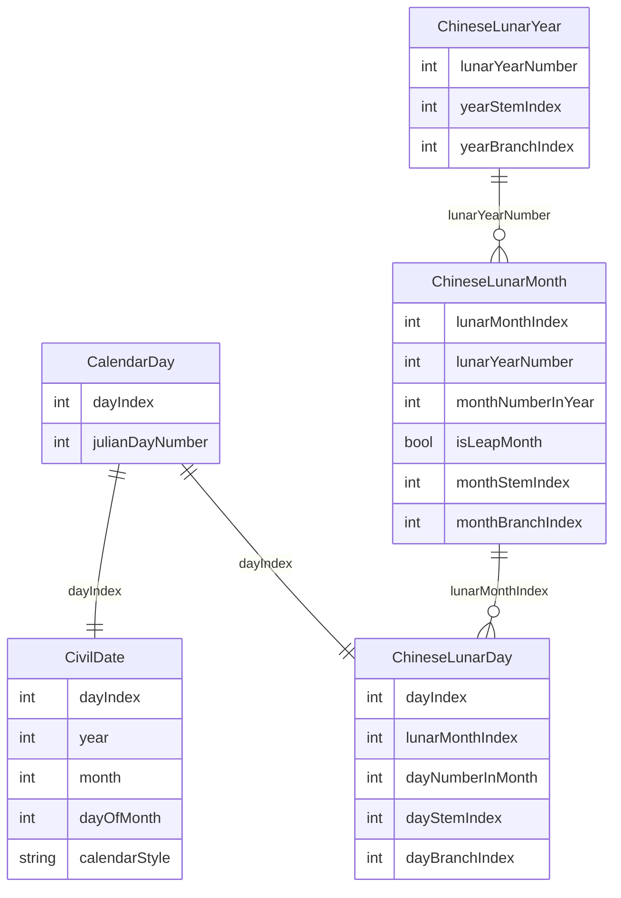

# 日历年月日数据模型

## 目的

本文档只定义 calendar facts 的基础数据模型：

- 一个农历日和一个公历日如何对应到同一天
- 农历年、月、日如何形成层级结构
- 年、月、日各自如何保存干支

年号、帝王、王朝、政权归属等 political attribution 暂不在本文档中建模。后续这些信息应通过同一套 `dayIndex` 关联到具体某一天，而不是混入基础日历模型。

## 核心原则

### 同一天先有稳定锚点

农历日和公历日是同一个 absolute day 的两种表达。数据层应先定义一个稳定的 day anchor：

- `dayIndex`：应用内部使用的连续日序号，从数据集起点开始递增。
- `julianDayNumber`：儒略日数，用于和外部历算资料交叉校验。

所有公历、农历、干支信息都通过 `dayIndex` 挂到同一天。

### 公历日是 civil 表达

公历日期用于用户导航和显示，但不作为同一天的唯一身份。

一条 day anchor 在当前数据集中应对应一条 civil date record：

- `dayIndex`
- `year`
- `month`
- `dayOfMonth`
- `calendarStyle`

`calendarStyle` 用于说明这条 civil date 是 Julian 还是 Gregorian。

Julian calendar 是儒略历，由 Julius Caesar 推行，规则中每 4 年置闰一次。Gregorian calendar 是格里历，由 1582 年的历法改革引入，修正了闰年规则：世纪年必须能被 400 整除才是闰年。两者在历史日期上会逐渐产生偏移，而且各地区采用 Gregorian calendar 的时间并不完全相同。

参考资料：

- [Julian calendar, Encyclopaedia Britannica](https://www.britannica.com/science/Julian-calendar)
- [Gregorian calendar, Encyclopaedia Britannica](https://www.britannica.com/topic/Gregorian-calendar)

首个版本可以采用项目固定的 reform boundary 来生成 `calendarStyle`。如果以后要支持不同地区的历法切换规则，应把 reform rule 显式建模，而不是让 `year/month/day` 自己隐含这层语义。

### 农历年月日是树状层级

农历结构按真实从属关系建模：

- `ChineseLunarYear`
- `ChineseLunarMonth`
- `ChineseLunarDay`

日是最低层级。每个农历日属于一个农历月，每个农历月属于一个农历年。

干支不是独立漂浮的记录，而是年、月、日各自的属性：

- 年有年干支
- 月有月干支
- 日有日干支

## 基础字段约定

### dayIndex 与 dayNumberInMonth

`dayIndex` 和 `dayNumberInMonth` 表达的是两件不同的事：

- `dayIndex`：整个数据集中的绝对日序号，例如第 0 天、第 1 天、第 2 天。它用于表示同一天，并连接公历和农历。
- `dayNumberInMonth`：农历月内的日序，例如初一是 `1`，十五是 `15`，三十是 `30`。

所以 `dayIndex` 可以跨年跨月连续递增，`dayNumberInMonth` 每个农历月都会从 `1` 重新开始。

### lunarMonthIndex 与 monthNumberInYear

`lunarMonthIndex` 和 `monthNumberInYear` 也表达不同概念：

- `lunarMonthIndex`：整个数据集中的连续农历月序号，用来把农历日关联到它所属的农历月。
- `monthNumberInYear`：农历年内的月序，例如正月是 `1`，十二月是 `12`。

闰月信息属于农历月本身，所以 `isLeapMonth` 放在 `ChineseLunarMonth` 上，不放在 `ChineseLunarDay` 上。

### 干支字段

基础数据中建议用整数保存天干、地支，而不是直接保存显示字符串：

- `stemIndex: Int`：`0...9`，对应甲、乙、丙、丁、戊、己、庚、辛、壬、癸。
- `branchIndex: Int`：`0...11`，对应子、丑、寅、卯、辰、巳、午、未、申、酉、戌、亥。

显示层再把整数转换成中文名，例如 `0 + 0 -> 甲子`。这样可以让 raw data 更容易校验，也避免同一概念在数据里出现多种写法。

## 关系图



## 实体设计

## CalendarDay

表示数据集中的一个 absolute day。

基础字段：

- `dayIndex: Int`
- `julianDayNumber: Int`

职责：

- 作为公历日和农历日对应关系的锚点
- 支持前一天、后一天、区间浏览等 timeline 操作
- 为后续年号、节气、节日等信息提供统一关联点

约束：

- `dayIndex` 在数据集中必须连续且唯一。
- `julianDayNumber` 在数据集中必须唯一。
- 一条 `CalendarDay` 应只有一条 `CivilDate` 和一条 `ChineseLunarDay`。

## CivilDate

表示某个 absolute day 的 civil date 表达。

基础字段：

- `dayIndex: Int`
- `year: Int`
- `month: Int`
- `dayOfMonth: Int`
- `calendarStyle: CivilCalendarStyle`

建议 enum：

- `julian`
- `gregorian`

职责：

- 支持按公历日期跳转
- 支持 UI 中展示公历年月日
- 明确记录该公历标签采用的 civil calendar rule

说明：

- `CivilDate` 不持有农历年月日字段。
- 查找某个公历日期时，应先找到对应 `dayIndex`，再读取同一天的农历日。

## ChineseLunarDay

表示一个具体农历日，也是农历层级中的最低节点。

基础字段：

- `dayIndex: Int`
- `lunarMonthIndex: Int`
- `dayNumberInMonth: Int`
- `dayStemIndex: Int`
- `dayBranchIndex: Int`

职责：

- 表达“某个农历月里的第几日”
- 保存日干支
- 通过 `dayIndex` 和 `CalendarDay` 建立与公历日的一对一对应
- 通过 `lunarMonthIndex` 关联到所属农历月

约束：

- `dayNumberInMonth` 只能是 `1...30`。
- 同一个 `lunarMonthIndex` 下的 `dayNumberInMonth` 必须唯一。
- `lunarMonthIndex` 必须指向一条真实存在的 `ChineseLunarMonth`。
- 每个 `ChineseLunarDay` 必须对应且只对应一个 `CalendarDay`。
- 日干支使用 `dayStemIndex` 和 `dayBranchIndex` 保存，显示时再转换成中文。

## ChineseLunarMonth

表示一个具体农历月。这里的“具体”指它已经属于某个农历年，而不是抽象的正月、二月。

基础字段：

- `lunarYearNumber: Int`
- `lunarMonthIndex: Int`
- `monthNumberInYear: Int`
- `isLeapMonth: Bool`
- `monthStemIndex: Int`
- `monthBranchIndex: Int`

职责：

- 作为农历日的 parent
- 表达闰月信息
- 保存月干支
- 通过 `lunarYearNumber` 关联到所属农历年

约束：

- `lunarMonthIndex` 在数据集中必须连续且唯一。
- `lunarYearNumber` 必须指向一条真实存在的 `ChineseLunarYear`。
- `monthNumberInYear` 只能是 `1...12`。
- 同一个 `lunarYearNumber` 下，普通月的 `monthNumberInYear` 必须唯一。
- 如果存在闰月，则同一年中同一个 `monthNumberInYear` 可以同时有普通月和闰月，但二者必须通过 `isLeapMonth` 区分。

说明：

- 月份的起止 `dayIndex`、天数等信息可以从该月下所有 `ChineseLunarDay` 派生，不属于最基本的 raw data。

## ChineseLunarYear

表示一个具体农历年。

基础字段：

- `lunarYearNumber: Int`
- `yearStemIndex: Int`
- `yearBranchIndex: Int`

职责：

- 作为农历月的 parent
- 保存年干支

说明：

- `lunarYearNumber` 只是连续编号或导入后的年份标识，不等同于年号纪年。
- 年界首个版本按正月初一处理；如果未来要支持立春换年等干支年界规则，应作为明确的 calendar rule 扩展，而不是隐含在字段里。
- 年份的起止 `dayIndex`、月数、天数等信息可以从下属月份和日期派生，不属于最基本的 raw data。

## 关系键

基础模型不需要额外的 `id` 字段来表达日历事实本身。

推荐使用以下关系键：

- `CalendarDay`：`dayIndex`
- `CivilDate`：`dayIndex`
- `ChineseLunarDay`：`dayIndex`
- `ChineseLunarDay -> ChineseLunarMonth`：`lunarMonthIndex`
- `ChineseLunarMonth`：`lunarMonthIndex`
- `ChineseLunarMonth -> ChineseLunarYear`：`lunarYearNumber`
- `ChineseLunarYear`：`lunarYearNumber`

如果某个存储层需要稳定字符串 ID，可以在导入时派生，而不要把它当作 raw data。日记录统一使用 `day-{dayIndex}`，例如 `day-0`、`day-1`。

## 显示层派生值

以下内容不建议存为基础 raw data，可以在 domain 或 UI formatting helper 中生成：

- `dayDisplayName`：例如 `1 -> 初一`，`15 -> 十五`，`30 -> 三十`。
- `monthDisplayName`：例如 `1 -> 正月`，`2 + isLeapMonth -> 闰二月`。
- `stemBranchDisplayName`：例如 `stemIndex = 0` 且 `branchIndex = 0` 时显示 `甲子`。
- `monthDayCount`：从同一个农历月下的 `ChineseLunarDay` 数量计算。
- `yearMonthCount` 和 `yearDayCount`：从同一个农历年下的月份和日期计算。
- `startDayIndex` 和 `endDayIndex`：从子节点的最小和最大 `dayIndex` 计算。

这样 raw data 保持小而稳定，显示规则也可以集中管理。

## 查询方式

### 通过公历日查农历日

步骤：

1. 使用 `CivilDate(year, month, dayOfMonth, calendarStyle)` 找到 `dayIndex`。
2. 使用 `dayIndex` 找到 `CalendarDay`。
3. 使用同一个 `dayIndex` 找到 `ChineseLunarDay`。
4. 使用 `ChineseLunarDay.lunarMonthIndex` 找到所属农历月。
5. 使用 `ChineseLunarMonth.lunarYearNumber` 找到所属农历年。

返回结果可以组合出：

- 公历年月日
- 农历年、月、日
- 年干支、月干支、日干支
- 闰月标记

### 通过农历日查公历日

步骤：

1. 使用 `lunarYearNumber + monthNumberInYear + isLeapMonth` 找到 `ChineseLunarMonth`。
2. 使用 `lunarMonthIndex + dayNumberInMonth` 找到 `ChineseLunarDay`。
3. 使用该日的 `dayIndex` 找到 `CalendarDay`。
4. 使用同一个 `dayIndex` 找到 `CivilDate`。

## Foundation Date 与 Calendar

`Date` 和 `NSDate` 表示的是一个绝对时间点，不包含“这是哪一种历法下的年月日”这层语义。`Calendar` 负责把绝对时间点解释成某个历法下的 components。

参考资料：

- [Date, Apple Developer Documentation](https://developer.apple.com/documentation/foundation/date)
- [Calendar, Apple Developer Documentation](https://developer.apple.com/documentation/foundation/calendar)

对本项目来说，可以这样使用 Foundation：

- Gregorian 日期的现代格式化和基本校验可以使用 `Calendar(identifier: .gregorian)`。
- `Date` 适合作为 UI 或系统 API 的桥接类型，但不适合作为本项目的 day identity。
- 历史 Julian/Gregorian 混合规则、1582 reform boundary、不同地区采用 Gregorian 的差异，不应隐含依赖 Foundation 自动处理。

因此 processed calendar data 仍应以 `dayIndex` 和 `julianDayNumber` 为主锚点，civil date 由明确的导入算法或 source data 生成。Foundation 可以用于交叉校验和展示，但不应替代项目自己的历史 calendar rule。

## Processed Artifact 建议

导入流水线可以先产出扁平 artifact，再导入 SwiftData 或其他存储层时组装层级。

建议文件：

- `Data/Processed/calendar_days/calendar_days.jsonl`

每行表示一个 absolute day，字段示例：

```json
{
  "dayIndex": 0,
  "julianDayNumber": 1721426,
  "civil": {
    "year": 1,
    "month": 1,
    "dayOfMonth": 1,
    "calendarStyle": "julian"
  },
  "lunarYear": {
    "yearNumber": 1,
    "yearStemIndex": 7,
    "yearBranchIndex": 9
  },
  "lunarMonth": {
    "lunarMonthIndex": 0,
    "yearNumber": 1,
    "monthNumberInYear": 11,
    "isLeapMonth": false,
    "monthStemIndex": 6,
    "monthBranchIndex": 0
  },
  "lunarDay": {
    "lunarMonthIndex": 0,
    "dayNumberInMonth": 1,
    "dayStemIndex": 0,
    "dayBranchIndex": 0
  }
}
```

导入时由这份扁平数据生成：

- 一组 `CalendarDay`
- 一组 `CivilDate`
- 去重后的 `ChineseLunarYear`
- 去重后的 `ChineseLunarMonth`
- 一组 `ChineseLunarDay`

## 校验规则

导入或测试时至少应校验：

- `dayIndex` 连续无断裂。
- `lunarMonthIndex` 连续无断裂。
- 每个 `CalendarDay` 恰好有一条 civil date 和一条 lunar day。
- 每个 `ChineseLunarDay` 都能向上找到 month 和 year。
- 每个农历月的 day count 只能是 29 或 30。
- 每个农历年的 month count 通常是 12 或 13。
- 同一年中闰月不能超过一个，除非 source data 明确支持特殊情况并记录原因。
- `stemIndex` 必须在 `0...9`。
- `branchIndex` 必须在 `0...11`。

## 与现有代码的映射

当前 persistence model 已经接近这个结构，但命名还带有 `Instance`：

- `ChineseCalendarDay` 同时承担 absolute day anchor 和 lunar day node 的职责。
- `CivilDateRecord` 保存 civil date 表达。
- `ChineseLunarMonthInstance` 对应本文档中的 `ChineseLunarMonth`。
- `ChineseLunarYearInstance` 对应本文档中的 `ChineseLunarYear`。

后续实现可以选择两条路线之一：

- 保持现状：继续让 `ChineseCalendarDay` 同时保存 `dayIndex`、`julianDayNumber`、`lunarDayRawValue` 和日干支。
- 拆分模型：新增 `CalendarDay` 作为纯 absolute anchor，再新增 `ChineseLunarDay` 作为农历日节点。

如果短期目标是尽快导入和浏览数据，保持现状更简单。如果后续需要在同一个 absolute day 上挂载更多非农历事实，拆分模型会让边界更清晰。

## 暂不处理的问题

- 年号纪年
- 王朝、帝王、政权归属
- 同一天的多 political timeline
- 节气、节日、宜忌等扩展信息
- 不同地区的 Gregorian reform 差异

这些内容都可以在未来通过 `dayIndex` 关联到同一天，不需要改变本文档定义的年月日主干结构。
