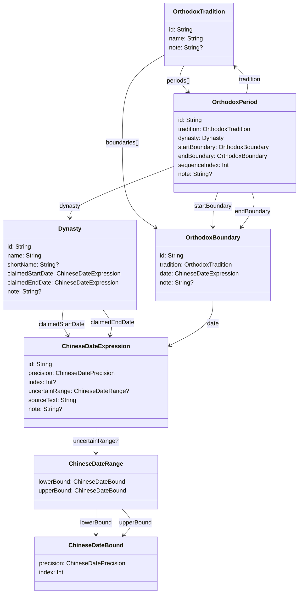

# 朝代与正统时间数据模型

## 目的

本文档定义朝代和正统历史叙事的基础数据模型。范围只包括：

- 朝代自身宣称的开始和结束时间
- 这些时间的农历表达和精度
- 某一种正统历史观下，某一段时间归属于哪个朝代

本文档暂不建模年号、帝王、谥号、庙号等信息。历史文本中可以保留这些字样作为 `sourceText`，但它们不作为结构化关系参与本模型。

## 核心原则

### 朝代自称时间与正统时间分离

一个朝代可以在某一年已经自称建立，但在后世主流王朝序列里，从更晚的时间才被视为正统王朝。

例如清政权在 1636 年改国号为大清，但主流王朝序列通常从 1644 年开始把清列为全国性正统王朝。两者不应互相覆盖：

- `Dynasty` 记录朝代自己的宣称起止。
- `OrthodoxPeriod` 记录某种正统历史观下的归属时间段。

### 时间使用农历表达

朝代起止和正统起止都应优先保存为项目已有 Chinese calendar 中的农历时间表达。

农历日期本身不依赖年号。年号只是政治标签，不应替代农历年、月、日。

### 不精确日期是一等数据

史料有时只能精确到农历年，或农历月。模型不能把它强行补成正月初一或某月初一。

每个日期表达都需要保存精度。不能确定为单个年、月、日时，可以表达为一个可能范围：

- `year`：只知道农历某一年。
- `month`：知道农历某年某月，但不知道具体日。
- `day`：知道农历某年某月某日。
- `range`：只能确定上下界，不能确定为单个年、月、日。
- `unknown`：有原文，但暂时不能结构化。

如果需要排序或查询重合，应从日期表达的 `index` 或 `uncertainRange` 派生查询边界，而不是修改原始表达。

### 正统是某种历史观的判断

“正统”不是朝代本身的固有属性。它必须属于某一个 `OrthodoxTradition`。

首个版本可以只录入一个传统，例如“主流中国王朝序列”。但模型应允许以后加入其他视角，例如南明立场、清官方叙事、地方政权序列等。

### 正统交接点应被共享

在同一个 `OrthodoxTradition` 下，相邻的正统时期不应各自复制一份结束和开始日期。交接点单独建模为 `OrthodoxBoundary`，上一个 `OrthodoxPeriod.endBoundary` 和下一个 `OrthodoxPeriod.startBoundary` 指向同一个对象。

## 实体概览



示例约定：`Type(id: "...")` 表示引用已有对象；被当前对象持有的值对象直接展开字段。示例中的 `index` 使用占位符，实际整数由基础日历数据导入后填写。

## 引用与持有说明

### `Dynasty` 和 `ChineseDateExpression`

一个 `Dynasty` 单向持有两个不同语义的日期表达：`claimedStartDate` 和 `claimedEndDate`。

这不是多个同类日期列表，因为这里表达的是朝代自身存在区间的两个边界：开始和结束。清的自称开始可以是“1636 年四月改国号大清”，结束可以是“宣统三年十二月廿五日”。南明这种边界不清楚的政权，也仍然是开始、结束两个语义位置，只是其中某个 `ChineseDateExpression` 可以用 `range` 或 `unknown` 表达不精确。

所以这里建成两个必有字段，而不是可选字段。即使日期完全没有解析出来，也保留一个 `precision = unknown` 的 `ChineseDateExpression`，用来承载原文和说明。

### `ChineseDateExpression`、`ChineseDateRange` 和 `ChineseDateBound`

一个 `ChineseDateExpression` 通常只有一个 `precision + index`。只有 `precision = range` 时，才有一个 `ChineseDateRange`。

这里的范围只用于“不确定落点”的情况。普通的“宣统三年十二月廿五日”已经能落到一个 `dayIndex`，不需要范围；“某一年”已经能落到一个 `lunarYearNumber`，也不需要范围。

`ChineseDateRange` 必须有两个 `ChineseDateBound`：`lowerBound` 和 `upperBound`。如果史料表达的是“某一年内，大约在某几个月之间”，这不是 `precision = year`，而是 `precision = range`，并且上下界都用月精度的 `ChineseDateBound`。例如“某事约在顺治二年三月至五月之间”，下界可以是三月的 `lunarMonthIndex`，上界可以是五月后的边界月。

`ChineseDateRange` 单向持有 `ChineseDateBound`。`lowerBound` 和 `upperBound` 是 ownership 字段，不表示 `ChineseDateBound` 有反向引用。`ChineseDateBound` 也不作为独立可查询实体；它只是 range 内部的边界值。

`ChineseDateBound` 不保存 `sourceText`，因为它只是范围计算用的结构化边界；原始中文表达仍然保存在外层 `ChineseDateExpression.sourceText`。

### `OrthodoxTradition` 和 `OrthodoxPeriod`

一个 `OrthodoxTradition` 可以持有多个 `OrthodoxPeriod`。

原因是正统叙事本身是一条时期序列，不是单个朝代标签。例如“主流中国王朝序列”里会有元、明、清等多个时期。每个 `OrthodoxPeriod` 单向引用一个 `OrthodoxTradition`，因为同一个时期在不同正统叙事下可能有不同边界和排序。

### `OrthodoxTradition` 和 `OrthodoxBoundary`

一个 `OrthodoxTradition` 可以持有多个 `OrthodoxBoundary`。

如果一个传统有 n 个正统时期，通常需要 n + 1 个边界：第一个时期的开始、相邻时期之间的交接点、最后一个时期的结束。例如主流序列里可以有 `yuan_ming_boundary`、`ming_qing_boundary`、`qing_republic_boundary`。

每个 `OrthodoxBoundary` 单向引用一个 `OrthodoxTradition`，因为“明清交接点”在主流叙事、南明立场、清官方叙事里可能不是同一个时间点。

### `OrthodoxBoundary` 和 `ChineseDateExpression`

一个 `OrthodoxBoundary` 单向持有一个 `date`。

这个 `date` 可以精确到年、月、日，也可以是范围；精度由 `ChineseDateExpression` 自己表达，不在 `OrthodoxBoundary` 上重复保存。比如 `ming_qing_boundary.date` 可以是“顺治元年，清入关占据北京”，如果暂时只能确定到农历年，就保存为 `precision = year`。

### `OrthodoxPeriod`、`OrthodoxBoundary` 和 `Dynasty`

一个 `OrthodoxPeriod` 必须单向引用一个 `dynasty`、一个 `startBoundary`、一个 `endBoundary`。

原因是 `OrthodoxPeriod` 表达的是“某个传统下，从一个边界到另一个边界之间归属于某个朝代”。例如 `mainstream_ming` 的 `dynasty: Dynasty(id: "ming")`，`startBoundary: OrthodoxBoundary(id: "yuan_ming_boundary")`，`endBoundary: OrthodoxBoundary(id: "ming_qing_boundary")`。

同一个 `OrthodoxBoundary` 在一条线性正统序列中通常会被一个或两个 `OrthodoxPeriod` 使用：第一段的起点只被后一段使用，最后一段的终点只被前一段使用，中间交接点会同时作为上一段的 `endBoundary` 和下一段的 `startBoundary`。例如 `ming_qing_boundary` 同时是 `mainstream_ming.endBoundary` 和 `mainstream_qing.startBoundary`。

更精确地说，同一个 `OrthodoxBoundary` 最多作为一个 `OrthodoxPeriod.startBoundary`，也最多作为一个 `OrthodoxPeriod.endBoundary`。中间交接点之所以能被两个时期共享，是因为它分别承担一个时期的结束和另一个时期的开始。

从反向查询看，一个 `Dynasty` 可以被零个、一个或多个 `OrthodoxPeriod` 引用。零个表示它存在于朝代表中，但不进入某个正统叙事，例如主流序列里可以不收南明。一个表示它在某个传统中只有一段正统归属，例如主流序列里的清。

多个 `OrthodoxPeriod` 主要用于同一个正统传统内的分段归属。典型例子是唐朝中间夹着武周：在某个传统里可以建成 `唐 -> 武周 -> 唐` 三段，其中前后两段都引用同一个 `Dynasty(id: "tang")`，中间一段引用 `Dynasty(id: "wu_zhou")`。

如果不同正统叙事对一个王朝的开始边界不同，而且这个差异已经影响“这个王朝自身从何时开始存在”的定义，不应让同一个 `Dynasty` 在不同传统下承担互相冲突的身份。更清楚的做法是建立不同的 `Dynasty` 或政权记录，再分别放入对应的 `OrthodoxPeriod`。

## `Dynasty`

表示一个朝代、政权或可被用户作为朝代浏览的政治实体。

建议字段：

- `id`：稳定标识，例如 `ming`、`qing`、`southern_ming`、`ming_zheng`。
- `name`：正式显示名称，例如“明”“清”“南明”“明郑”。
- `shortName`：短显示名，可选。
- `claimedStartDate`：朝代自称或通常认为其自身存在开始的农历日期表达。
- `claimedEndDate`：朝代自称或通常认为其自身存在结束的农历日期表达。
- `note`：说明此朝代边界的口径。

示例：

```text
Dynasty {
    id: "qing"
    name: "清"
    shortName: "清"
    claimedStartDate: ChineseDateExpression {
        id: "qing_claimed_start"
        precision: month
        index: <1636 年四月对应的 lunarMonthIndex>
        uncertainRange: null
        sourceText: "1636 年四月改国号大清"
        note: "月精度；不等同于主流正统开始边界"
    }
    claimedEndDate: ChineseDateExpression {
        id: "qing_claimed_end"
        precision: day
        index: <宣统三年十二月廿五日对应的 dayIndex>
        uncertainRange: null
        sourceText: "宣统三年十二月廿五日"
        note: null
    }
    note: "朝代自身宣称边界"
}
```

```text
Dynasty {
    id: "southern_ming"
    name: "南明"
    shortName: "南明"
    claimedStartDate: ChineseDateExpression {
        id: "southern_ming_claimed_start"
        precision: year
        index: <崇祯十七年对应的 lunarYearNumber>
        uncertainRange: null
        sourceText: "崇祯十七年以后明宗室在南方相继建立政权"
        note: "只精确到农历年"
    }
    claimedEndDate: ChineseDateExpression {
        id: "southern_ming_claimed_end"
        precision: range
        index: null
        uncertainRange: ChineseDateRange {
            lowerBound: ChineseDateBound {
                precision: month
                index: <可能下界对应的 lunarMonthIndex>
            }
            upperBound: ChineseDateBound {
                precision: month
                index: <可能上界后一月对应的 lunarMonthIndex>
            }
        }
        sourceText: "永历帝被杀，南明亡"
        note: "资料不足时用范围表达"
    }
    note: "不进入首版主流正统序列也仍可作为朝代记录存在"
}
```

注意：这些 `sourceText` 可以包含年号或帝号，但首版不解析年号关系。

## `ChineseDateExpression`

表示一个农历日期表达。它可以是不完整日期，并且使用项目唯一的 Chinese calendar 作为坐标系。

建议字段：

- `id`：稳定标识。
- `precision`：`year`、`month`、`day`、`range`、`unknown`。
- `index`：单点表达的结构化锚点，含义由 `precision` 决定。
- `uncertainRange`：不确定范围，仅 `precision = range` 时存在。
- `sourceText`：原始中文时间表达。
- `note`：解析说明或争议说明。

`index` 规则：

- `precision = year` 时，`index` 是 `ChineseLunarYear.lunarYearNumber`。
- `precision = month` 时，`index` 是 `ChineseLunarMonth.lunarMonthIndex`。
- `precision = day` 时，`index` 是 `CalendarDay.dayIndex`。

范围规则：

- `precision = range` 时，`index = null`，`uncertainRange` 必填。

`uncertainRange` 包含 `lowerBound` 和 `upperBound`，二者都使用 `ChineseDateBound`，字段为 `precision` 和 `index`。例如上界、下界可以都是月，用来表达“某一年内的某几个月之间”；也可以都是年，用来表达跨年的不确定范围。只要能换算成半开的 dayIndex 查询边界即可。

如果 `precision = unknown`，允许只保存 `sourceText`，待后续人工或导入脚本解析。

说明：月精度时 `index` 指向 `ChineseLunarMonth.lunarMonthIndex`，比 `monthNumberInYear + isLeapMonth` 更适合作为结构化锚点。历史上可能出现同一农历年内月份编号异常或重复的情况，例如改历、改元附近的特殊置月；连续的 `lunarMonthIndex` 可以直接指向基础日历中的那个具体农历月。

不再单独建 `ResolvedDateWindow` 表。日期表达已经能通过 `precision + index` 或 `uncertainRange` 回到基础日历模型；查询需要的 dayIndex 范围可以按需计算。

## `OrthodoxTradition`

表示一种正统历史观或王朝序列口径。

建议字段：

- `id`：稳定标识，例如 `mainstream_chinese_dynastic_sequence`。
- `name`：显示名称，例如“主流中国王朝序列”。
- `note`：该传统的边界说明。

首版可以只建一条：

```text
OrthodoxTradition {
    id: "mainstream_chinese_dynastic_sequence"
    name: "主流中国王朝序列"
    note: "首版默认正统叙事口径"
}
```

## `OrthodoxBoundary`

表示某一种正统历史观下的时间边界或交接点。它不是朝代归属本身，而是 `OrthodoxPeriod` 之间共享的边界。

建议字段：

- `id`：稳定标识。
- `tradition`：所属正统历史观。
- `date`：边界对应的农历日期表达。
- `note`：边界说明或争议说明。

规则：

- 同一个 `OrthodoxTradition` 下，相邻 `OrthodoxPeriod` 应复用同一个 `OrthodoxBoundary`。
- 第一段正统时期的起点和最后一段正统时期的终点也使用 `OrthodoxBoundary` 表达。
- `date.precision` 属于 `ChineseDateExpression`，不在 `OrthodoxBoundary` 或 `OrthodoxPeriod` 上重复保存。

示例：

```text
OrthodoxBoundary {
    id: "ming_qing_boundary"
    tradition: OrthodoxTradition(id: "mainstream_chinese_dynastic_sequence")
    date: ChineseDateExpression {
        id: "ming_qing_boundary_date"
        precision: year
        index: <顺治元年对应的 lunarYearNumber>
        uncertainRange: null
        sourceText: "顺治元年，清入关占据北京"
        note: "正统交接边界，暂只精确到农历年"
    }
    note: "明清正统交接边界"
}
```

## `OrthodoxPeriod`

表示某一种正统历史观下，两个边界之间的农历时间属于某个朝代。

建议字段：

- `id`：稳定标识。
- `tradition`：所属正统历史观。
- `dynasty`：归属朝代。
- `startBoundary`：正统归属开始边界。
- `endBoundary`：正统归属结束边界。
- `sequenceIndex`：在该传统中的排序。
- `note`：边界说明。

显示标签从 `dynasty.name` 或 `dynasty.shortName` 派生，不在 `OrthodoxPeriod` 上重复保存。

示例：

```text
OrthodoxPeriod {
    id: "mainstream_ming"
    tradition: OrthodoxTradition(id: "mainstream_chinese_dynastic_sequence")
    dynasty: Dynasty(id: "ming")
    startBoundary: OrthodoxBoundary(id: "yuan_ming_boundary")
    endBoundary: OrthodoxBoundary(id: "ming_qing_boundary")
    sequenceIndex: 0
    note: "主流正统序列中的明"
}
```

```text
OrthodoxPeriod {
    id: "mainstream_qing"
    tradition: OrthodoxTradition(id: "mainstream_chinese_dynastic_sequence")
    dynasty: Dynasty(id: "qing")
    startBoundary: OrthodoxBoundary(id: "ming_qing_boundary")
    endBoundary: OrthodoxBoundary(id: "qing_republic_boundary")
    sequenceIndex: 1
    note: "主流正统序列中的清"
}
```

这里 `mainstream_ming.endBoundary` 和 `mainstream_qing.startBoundary` 指向同一个 `OrthodoxBoundary`。清的 `Dynasty.claimedStartDate` 可以是 1636 年四月，而清的正统开始边界可以是 1644 年，二者并不冲突。

## 区间语义

历史时期建议使用半开区间：

```text
[start, end)
```

也就是说，开始边界包含，结束边界不包含。这样相邻朝代可以共享一个边界而不重叠。

`OrthodoxPeriod` 自己不保存一份开始/结束日期，而是通过 `startBoundary.date` 和 `endBoundary.date` 得到半开区间边界。如果历史事件发生日和正统归属切换日不是同一天，应以归属切换日作为 `OrthodoxBoundary.date`，并在 `note` 中保留说明。

## 查询原则

### 查某天属于哪个正统朝代

1. 选择一个 `OrthodoxTradition`。
2. 将目标日转成 `dayIndex`。
3. 读取该传统下 `OrthodoxPeriod.startBoundary.date` 和 `endBoundary.date`。
4. 按 `date.precision`、`date.index` 或 `date.uncertainRange` 换算成 `dayIndex` 半开区间。
5. 找到满足 `start <= dayIndex < end` 的记录。

如果边界只有年精度、月精度，或本身是范围表达，换算出的区间可能需要标记为 approximate。

### 查某朝代自己的存在时间

读取 `Dynasty.claimedStartDate` 和 `Dynasty.claimedEndDate`，优先展示 `sourceText` 和 `precision`。

如果需要排序，按 `precision + index` 或 `uncertainRange` 派生排序键。

### 查重合关系

朝代自称时间可以重合，正统时间也可以因不同传统而重合。不要在 `Dynasty` 层面加全局不重叠约束。

同一个 `OrthodoxTradition` 下，首版可以要求 `OrthodoxPeriod` 按 `sequenceIndex` 排序，并尽量不重叠。但如果边界精度较粗，应允许人工标注争议。

## 首版取舍

首版建议只做以下内容：

- 建立 `Dynasty`。
- 建立 `ChineseDateExpression`，支持年、月、日和范围表达。
- 建立一个 `OrthodoxTradition`：主流中国王朝序列。
- 建立 `OrthodoxBoundary`，记录正统叙事里的交接边界。
- 建立 `OrthodoxPeriod`，记录两个边界之间的主流正统归属。
- 保留所有原始中文时间到 `sourceText`。

首版暂不做：

- 年号实体。
- 帝王实体。
- 多种正统历史观的完整比较。
- 自动从任意中文时间文本解析农历日期。

## 与日历基础模型的关系

`Docs/data-model-calendar.md` 定义的是基础 calendar facts。本文档中的政治归属不应混入 `ChineseLunarYear`、`ChineseLunarMonth`、`ChineseLunarDay`。

当日期可解析时，通过 `dayIndex` 与基础日历数据连接。这样同一天可以同时拥有：

- 公历表达
- 农历表达
- 朝代自称时间范围
- 某种正统历史观下的朝代归属
