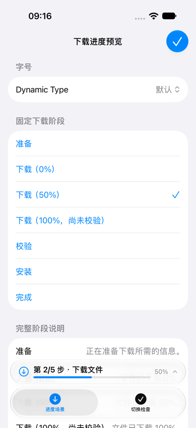
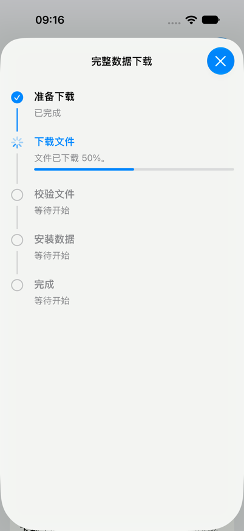

# Issue #133：下载进度与持久续传

关联：[Issue #133](https://github.com/huahuahu/chinese-calendar/issues/133)。

## 最终行为

- 底部附件显示紧凑摘要，点击后打开可滚动的五阶段详情：准备下载、下载文件、校验文件、安装数据、完成。
- 只有下载阶段显示文件百分比与进度条，不把文件下载进度包装成整个安装流程的完成比例。
- `.inline` 主动选择简洁展示；非 inline 使用 `ViewThatFits` 根据可用空间选择布局。
- 清单提供总字节数，收到并成功写入每块数据后更新进度；不依赖响应的 `Content-Length`。
- 片段目录包含完整 SHA-256；重新发起下载时按磁盘中的片段大小续传，不会在 App 启动时自动下载。
- 带偏移的请求收到 416 或错误的 `Content-Range` 时，等请求结束、文件关闭，删除片段后从零重试一次。删除失败直接报错；普通断网、超时或取消保留片段。

## 自动验证（2026-10-06）

- 原生 Xcode MCP，`ChineseCalendar-iOS` scheme，专用 iPhone 18 Pro 模拟器。
- 36 个测试实例通过：30 个下载测试实例、6 个 UI 状态与模拟流程测试。
- 网络由 `SeedDownloadURLProtocol` 完全拦截，未知请求立即失败；没有访问真实下载源。
- 测试在响应暂停于 50% 时读取文件，证明片段已经落盘；随后取消或注入断网，再用新会话和安装器从 50% 续传。
- 覆盖有无 `Content-Length`、206 续传、200 忽略 Range、错误偏移回退、最多一次重试、清理失败、普通网络/HTTP 失败、完整片段跳过网络及非法清单。
- SwiftFormat、严格 SwiftLint、`git diff --check` 通过。
- 同步主分支至 `608c71e4` 后，包含测试目标的构建通过。

## 运行截图与交互

以下截图来自 2026-10-06 的实际模拟器运行，使用 DEBUG 固定场景；后续网络实现与命名调整没有改变这些 UI。

| 底部摘要：文件下载 50% | 五阶段详情：文件下载 50% |
| --- | --- |
|  |  |

准备、0%、50% 的附件与详情可读，无裁切；主界面模拟流程中，打开的详情能从准备实时更新到下载，完成后自动关闭。

## 验证边界

- 没有进行真实下载源、真机杀进程重启或真实数据库替换的端到端验证。
- 最大辅助字号与 inline 的组合、完整方向/尺寸矩阵以及实际 VoiceOver 朗读和焦点导航尚未全部复验，Issue #133 保留这些验收项。
- 取消测试验证下载器结束请求、关闭文件后返回；`clearDownloadedData` 与 `installEvents` 内部生产任务的等待边界沿用现有实现，不属于本次测试覆盖范围。
