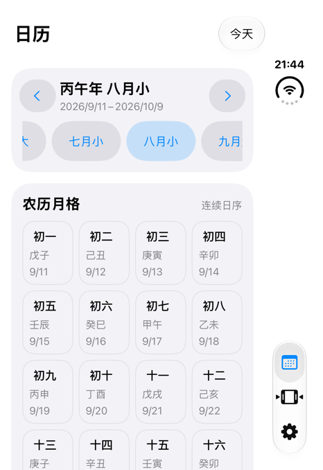
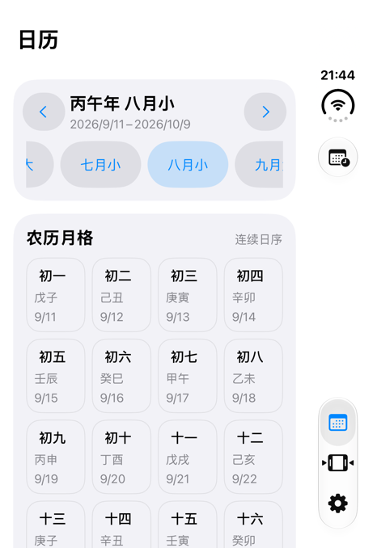
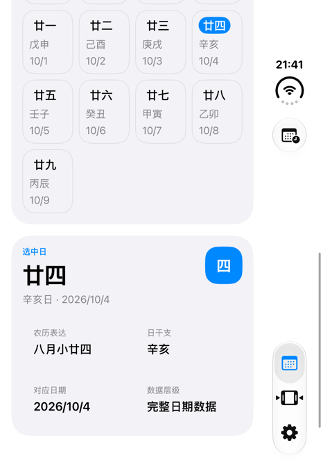

# Issue #135：Duo 工具栏适配与验证

关联工单：[iPhone Duo 日历页导航异常](https://github.com/huahuahu/chinese-calendar/issues/135)。

## 当前提交版本（2026-10-05）

最终提交的 `CalendarTodayToolbar` 保留单一 `Button` 与私有 `TodayLabelStyle`：

- iOS 27.1 起读取 `toolbarVerticalEdge`。值为 `nil` 时使用 `.titleOnly` 显示“今天”，
  有值时使用 `.automatic`，由工具栏容器决定标签表示。
- 不设置 `axisBehavior`，工具栏项目的轴向与位置遵循系统的默认行为。
- `toolbarVerticalEdge` 反映系统的竖栏偏好，不表示按钮当前所在轴向；
  `.automatic` 在顶部横向工具栏中也可能只显示图标。
- 较早系统继续使用文字按钮；日期选择动作保持不变。
- 增加包含实际 `CalendarHomeView` 导航层级的 Preview，便于和独立页面 Preview 对照。

本次提交前针对以上最终源码重新检查：

- Xcode 27.1 Beta / iOS 27.1 SDK，`ChineseCalendar-iOS`，`iPhone Duo (issue-135)`：构建通过。
- 三个改动的 Swift 文件：SwiftFormat 与 SwiftLint strict 通过。
- `git diff --check` 通过。

本次提交前没有重新执行完整的设备交互矩阵。下文记录了多个阶段的实验，
其中带 `.axisBehavior(.verticalPreferred)` 的三场景点击与折叠回归属于另一版本，
不能视为当前默认轴向版本的交互验收。Canvas 遮挡、普通 iPhone 与完整方向／尺寸覆盖仍有未完成项，
本 PR 仅关联 #135，不自动关闭工单。

构建需要包含 `toolbarVerticalEdge` 的 iOS 27.1 SDK。运行时的 `#available` 分支不等于旧 SDK 编译支持；
仓库 CI 目前固定 Xcode 26.5，需要结合 PR 检查结果评估工具链兼容性。

## 历史方案说明与验证

以下保留此前的方案探索和证据；各节结果仅适用于对应版本，当前提交内容以上一节为准。

`YearMonthHeader` 的“今天”按钮同时提供中文标题与 `calendar.badge.clock` 图标。
iOS 27.1 起由 `CalendarTodayToolbar` 读取系统的 `toolbarVerticalEdge`：
没有竖栏偏好的上下文使用 `.labelStyle(.titleOnly)` 显示“今天”；有竖栏偏好时保留原生图标表示。
`ToolbarItem` 显式设置 `.axisBehavior(.verticalPreferred)`，允许带自定义标签样式的按钮进入竖栏。
`toolbarVerticalEdge` 表示上下文的竖栏偏好，不是单个按钮实际所在轴向。
iOS 26 使用文字样式。布局判断不依赖设备型号、屏幕宽高比或物理横竖屏。
辅助功能名称仍为“今天”。保留 `.primaryAction` 及原来的 `selectToday` 动作，
包括日期刷新、取消待处理的年份切换和跨年动画方向。

Apple 的 [Preparing your app for iPhone Duo](https://developer.apple.com/documentation/technologyoverviews/preparing-your-app-for-iphone-duo)
明确说明：只有标题、没有图标的工具栏项目不会竖向呈现；同时提供标题和图标可让系统选择适合当前布局的形式。
因此没有添加设备型号判断、固定安全区边距或自绘侧栏。

`CalendarPageView` 增加“完整日历 · 应用导航”Preview，使用真实的 `CalendarHomeView`
承载 TabView 与各标签页的 NavigationStack。原有“完整日历”保留为独立页面 Preview。

**2026-10-05 的 `verticalPreferred` 版本已在实际 App 验证内屏顶部文字、内屏侧栏图标和外屏侧栏图标；三种场景的切换月份后点击“今天”均通过。**
Canvas 圆孔遮挡尚未解决，工单不能据此全部验收。
修复前的实际 App 也没有复现文字被圆孔遮挡：文字按钮位于内容区顶部，系统侧栏仍存在。
静态 Preview 与实际窗口的布局不同，不能将 Preview 截图作为实际 App 遮挡的证据。

## 验证环境

- 日期：2026-10-04，Asia/Shanghai。
- Xcode：27.1 Beta；iOS Simulator：27.1（24A94401）。
- 分支：`codex/issue-135-duo-toolbar`；基线：`f90912b6395d8fe3238cac1b617b05d6ab31f416`。
- 实际运行：本任务独立的 `iPhone Duo (issue-135)`，外屏、Portrait。
- App 窗口：466 × 678 pt；外屏 framebuffer：1398 × 2034 px。
- 实际运行使用官方 `full-seed-store-2026.10.04` 完整日期库，schema 1.4.0；没有修改日期数据。
- RenderPreview 报告的目标是标准 `iPhone Duo` / iOS 27.1，而非专用模拟器。
  Preview 图像像素尺寸是工具输出尺寸，不等于实际窗口的 point 尺寸。

## 实际运行对照

两张图使用同一模拟器、同一数据与同一外屏窗口，分别构建原来的文字按钮和最初的标题加图标按钮。

| 改动前 | 改动后 |
| --- | --- |
|  |  |

AX 层级中，“今天”从顶部的 `{{320, 30}, {58, 36}}` 移到右侧的
`{{399, 175}, {38, 38}}`，点击位置为 `{418, 194}`。右侧同时保留日历、朝代、设置入口。

实际执行的操作与观察：

1. 点击“下个月”：八月（2026/9/11–10/9）切换为九月（2026/10/10–11/8）。
2. 点击右侧“今天”：回到八月。
3. 滚动页面：AX 确认“廿四，今天，日干支，辛亥，10/4”为 `Selected`，详情显示 `2026/10/4`。
4. 滚动后“今天”仍位于 `{418, 194}`，没有随内容滚出页面。
5. 点击“朝代”再返回“日历”：日期选择、详情及“今天”按钮均保留。

这是模拟器的真实点击与 AX 层级验证；不包含物理设备验证，也不等同于导航栈 push/pop 返回验证。

## Preview 验证与剩余问题

| 场景 | 输出尺寸 | 观察 |
| --- | --- | --- |
| Duo 外屏 Portrait，独立页面 | 1030 × 1500 px | 仍将图标放在顶部，与圆孔重叠 |
| Duo 外屏 Portrait，应用导航 | 1030 × 1500 px | TabView 出现在底部，仍未按实际窗口呈现系统竖栏 |
| Duo 内屏 Portrait | 1055 × 1499 px | 今天图标完整可见 |
| Duo 内屏 Landscape Left | 1499 × 1055 px | 今天图标完整可见 |

- [外屏独立页面](issue-135/preview-outer.png)
- [外屏应用导航](issue-135/preview-app-navigation.png)
- [内屏竖向](issue-135/preview-inner-portrait.png)
- [内屏横向](issue-135/preview-inner-landscape.png)

仅替换工具栏 placement、搬动 toolbar、使用 UIKit 导航容器、显式设置自动竖栏行为，
均未消除本次静态 Preview 的遮挡。这些实验没有保留为生产代码。
这说明当前 Preview 不能用于确认系统侧栏位置；尚未确认是否为特定 Xcode 版本的缺陷。

截至 2026-10-04 仍需完成（后续回归进展见文末）：

- Canvas 外屏遮挡的解决或可验证的上游修复。
- 真实运行中的内外屏切换、部分折叠、窗口尺寸变化及左右横屏。
  本次发送横屏事件后 App 层级仍报告 Portrait，不能记为横屏通过。
- 导航栈 push/pop 返回后工具栏的验证。
- 普通 iPhone 回归。切换 Xcode run destination 后 RenderPreview 仍返回 Duo；
  不将该结果记为普通 iPhone 验证。

## 构建与静态检查

- Xcode MCP `BuildProject`：通过，无构建错误。
- SwiftFormat：修改的 Swift 文件通过。
- SwiftLint strict：修改的 Swift 文件通过。
- `git diff --check`：通过。

此次仅调整按钮表示与 Preview 入口，没有改变日期解析逻辑，也没有新增模拟实现的单元测试。

## 横向文字显示的后续实现

用户要求顶部横向工具栏显示“今天”，侧边竖向工具栏继续显示图标。
使用 [toolbarVerticalEdge](https://developer.apple.com/documentation/swiftui/environmentvalues/toolbarverticaledge)
读取系统偏好的竖栏布局；它不是竖栏当前是否可见的标记。没有强制系统更换工具栏轴向。

2026-10-04 的追加验证：

- 文字样式试运行：实际 Duo 内屏顶部显示“今天”；内屏 Landscape Left Preview 也显示文字。
- 文字样式试运行：实际 Duo 外屏窗口为 678 × 466 pt，App UI orientation 为 Landscape Left。
  点击“下个月”后由八月切到九月，再点击“今天”回到八月。
  这些检查发生在加入 `toolbarVerticalEdge` 分支之前，只证明文字样式与原动作可用。
- 最终自适应版本：Xcode MCP `BuildProject` 通过；SwiftFormat、SwiftLint strict 和 `git diff --check` 通过。
  新增包源文件后需重新打开此 worktree 的 Xcode 工程，刷新 SwiftPM 源文件列表。
- 最终运行回归未完成：Mac 锁屏阻止 Device Hub 姿态操作；Xcode 重新安装运行调用未返回。
  随后 RenderPreview 报 `AppLaunchTimeoutError.Incomplete`，`XCPreviewAgent.app` 未能在 15 秒内启动。
  未将旧版本截图或先前的点击结果计作最终自适应版本的视觉/交互验收。

最终版本仍需在可操作的 Duo 模拟器上确认：顶部文字、侧栏图标，以及切换布局后点击“今天”。

## 2026-10-05：收敛 Button 定义

根据代码评审意见，`CalendarTodayToolbar` 现在只声明一个 `Button`，
通过私有 `TodayLabelStyle` 在标签内部选择 `.titleOnly` 或 `.automatic`。
保留系统默认样式对竖栏与溢出菜单的适配；动作与按钮结构不再随该条件切换。
标签内仍需条件选择，此改动不声称消除所有分支或获得可测量的性能提升。

- Xcode MCP 构建、SwiftFormat、SwiftLint strict、`git diff --check` 通过。
- 当前实现的 Duo 内屏 Landscape Left Preview 成功，顶部显示“今天”：
  [自适应文字 Preview](issue-135/preview-adaptive-title-landscape.png)。
- 当前实现已在专用 Duo 模拟器安装运行，Device Hub 中可见“今天”图标，辅助功能名称仍为“今天”。
- 本次没有完成内外屏与方向切换后的点击回归；完整工单验收仍以以上未完成项目为准。

## 2026-10-05：验证 `verticalPreferred`

本轮只在 `CalendarTodayToolbar` 的 `ToolbarItem` 上增加
`.axisBehavior(.verticalPreferred)`，保留单一 `Button`、`TodayLabelStyle` 和原来的日期选择动作。
依据是 Apple 的 [axisBehavior 文档](https://developer.apple.com/documentation/swiftui/toolbarcontent/axisbehavior(_:))
及 [自定义工具栏内容的公开实测](https://nilcoalescing.com/blog/ConfiguringSwiftUIToolbarsOnIPhoneDuo/)：
自定义内容需要声明支持竖栏，标签的自适应本身不等于允许系统迁移该项目。

运行环境为本任务专用的 `iPhone Duo (issue-135)`，设备 ID
`6DE0EAF7-69B7-4614-8D40-C45DDC4E2ADA`，scheme 为 `ChineseCalendar-iOS`。
共享配置文件仍记录另一个任务的 iPhone 18 Pro Max，本次仅使用已选定的专用 Duo，没有改写共享配置。

Xcode MCP `DeviceInteractionInstallAndRun` 已成功构建、安装并运行本次代码。
以下均来自正在运行的 App，不是 Canvas 或静态 Preview：

| 实际场景 | App 窗口 | 结果 | 证据 |
| --- | --- | --- | --- |
| 内屏展开、Landscape Right | 951 × 669 pt | “今天”图标进入右侧竖栏，与右侧 Tabs 对齐；顶部不再保留该图标 | [侧栏图标](issue-135/axis-preferred-inner-vertical.png) |
| 同一内屏转为 Portrait | 669 × 951 pt | 顶部横向栏显示“今天”文字；Tabs 回到底部 | [顶部文字](issue-135/axis-preferred-inner-horizontal.png) |

第一种场景对应用户此前“顶部仍是图标”的反馈。增加轴向声明后，按钮移入侧栏；
本方案不会把这个姿态下原位置的图标强制改为文字。

验证工具的限制：

- 原生设备交互截图抓到了未启用的外屏，图像为黑色；这不代表 App 黑屏。
- 第一张有效图通过 Device Hub 的 Screenshot 保存，第二张因 Mac 锁屏而改用活动内屏截图。
  原生 Xcode MCP 和 XcodeBuildMCP 的截图接口都没有显示器选择参数，故仅为该缺失能力回退到
  `simctl io screenshot --display=3`；显示器 ID 来自本设备的 `io enumerate`。
- 原生 AX 的可命中区域仍受外屏范围限制。按最新 AX 命中点点击“九月大”，重试一次后仍未切月，
  不能将这些点击记为成功。Mac 锁屏使 Device Hub 点击与折叠操作无法继续。
- 因此，解锁前仅确认两个内屏布局的显示；点击与外屏结果见下方解锁后的追加验证。

SwiftFormat、SwiftLint strict 和 `git diff --check` 均通过。主工作区 `main` 保持干净，
本次一行源码变更保留在 `codex/issue-135-duo-toolbar` 的独立工作区。

## 2026-10-05：解锁后实际点击与内外屏回归

继续使用同一专用 Duo 和已安装的 `verticalPreferred` 版本，未再修改源码。
通过 Device Hub 获取当前 App 的完整 AX，并点击真实控件。
每组均先点击“下个月”，确认进入九月大、选中初一（2026/10/10），
再点击“今天”，确认回到八月小、选中廿五（2026/10/5，壬子日）。

| 场景 | 按钮表示 | 日期往返 | 截图 |
| --- | --- | --- | --- |
| 内屏展开、Portrait，669 × 951 pt | 顶部“今天”文字 | 通过 | [九月](issue-135/axis-preferred-inner-horizontal-next-month.png) / [回到今天](issue-135/axis-preferred-inner-horizontal-today.png) |
| 内屏展开、Landscape Right，951 × 669 pt | 右侧竖栏图标 | 通过 | [九月](issue-135/axis-preferred-inner-vertical-next-month.png) / [回到今天](issue-135/axis-preferred-inner-vertical-today.png) |
| 折叠外屏、Portrait，466 × 678 pt | 右侧竖栏图标 | 通过 | [九月](issue-135/axis-preferred-outer-next-month.png) / [回到今天](issue-135/axis-preferred-outer-today.png) |

外屏的“今天”图标位于右侧系统状态区域下方。Device Hub 带设备外框的实际画面中，
圆孔与图标不重叠，图标可以正常点击。

随后从外屏重新展开，内屏恢复右侧竖栏图标；再向右旋转，顶部恢复“今天”文字。
整个过程中仍选中八月小廿五（2026/10/5）。最终设备枚举的方向是 Portrait Upside Down，
与第一组 Portrait 不同，但同为顶部横向工具栏。

- [重新展开后的侧栏图标](issue-135/axis-preferred-reopened-inner-vertical-today.png)
- [再次旋转后的顶部文字](issue-135/axis-preferred-reopened-inner-horizontal-today.png)
- [实际点击的 AX 关键证据与方法记录](issue-135/axis-preferred-runtime-results.txt)

另观察到首次折叠时月份芯片条保留先前的滚动位置，选中的八月可能暂时位于可见范围之外；
点击下个月再点击今天后会滚动到选中月份。本轮未调查该滚动行为，也没有证据将它归因于标签样式改动。

本轮使用固定设备 ID 与已枚举的活动显示器保存运行截图：内屏 Screen 3，外屏 Screen 1。
截图接口缺少显示器选择能力的原因同上一节。Device Hub 前台被其他任务切换时，
均重新确认 `iPhone Duo (issue-135)` 后再操作，未把其他模拟器的结果计入验证。

这些结果补齐了本方案的模拟器样式与点击验证，不等同于物理设备验证，
也不替代前文列出的 Canvas 遮挡、所有窗口尺寸、部分折叠、导航返回及普通 iPhone 验证。
