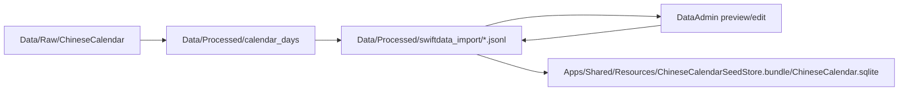

# DataAdmin

Local web editor for the processed JSONL facts that feed the SwiftData seed store.

## Run

From the repository root:

```bash
Scripts/DataAdmin/server.mjs
```

Then open:

```text
http://127.0.0.1:5177
```

Optional port override:

```bash
Scripts/DataAdmin/server.mjs --port 5180
```

## Data Flow



The editor writes one JSON object per JSONL line, so normal `git diff` remains useful during review.
SQLite is treated as generated output and should be rebuilt from JSONL.

## Supported Files

- `chinese_lunar_years.jsonl`
- `chinese_lunar_months.jsonl`
- `calendar_days/<year>/calendar_days.jsonl`
- `dynasties.jsonl`
- `emperors.jsonl`
- `emperor_reign_segments.jsonl`
- `reign_eras.jsonl`
- `chinese_date_expressions.jsonl`
- `orthodox_traditions.jsonl`
- `orthodox_boundaries.jsonl`
- `orthodox_periods.jsonl`

## Checks

The web UI exposes the same local commands used by the data pipeline:

```bash
Scripts/DataSchemas/generate_schema_artifacts.swift --check
Scripts/DataSchemas/validate_swiftdata_import.swift
Scripts/ImportChineseCalendar/generate_swiftdata_import.swift --validate-only
Scripts/ImportChineseCalendar/generate_dynasty_periods.swift --validate-only
```

The `Build SQLite` button runs:

```bash
Scripts/BuildChineseCalendarSeedStore/generate_seed_store_if_needed.sh
```
